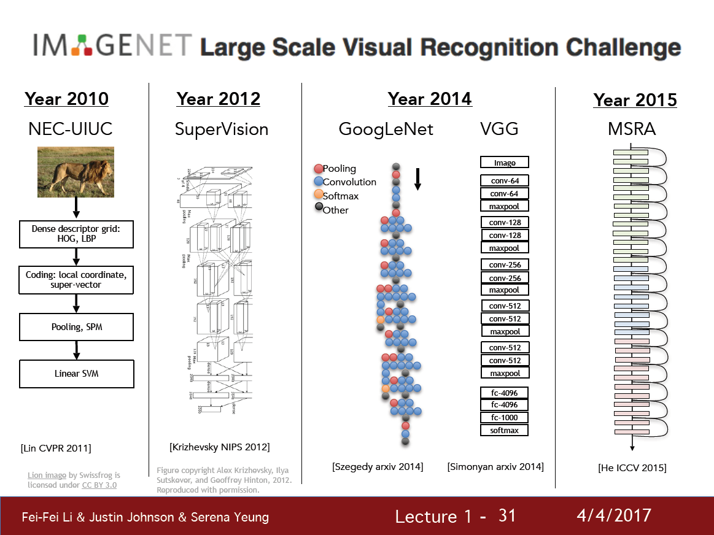

*해당 자료는 Stanford에서 제공하는 CS231n(2017)과 Lecture Note를 바탕으로 작성된 것임을 밝힙니다.* 

https://www.youtube.com/playlist?list=PL3FW7Lu3i5JvHM8ljYj-zLfQRF3EO8sYv

# Lecture 1. Introduction to Convolutional Neural Networks for Visual Recognition

---

# 1. Computer Vision Motivation

1. 이 세상의 모든 것을 어떻게 인식할 수 있을까?
2. 기계학습의 Overfitting 문제를 어떻게 극복할 수 있을까?(이미지는 수많은 feature들로 이루어져 있기 때문에 그만큼 필요로 하는 parameter의 수가 증가하기 때문)

# 2. Convolutional Neural Networks

1. 2012년에 CNN의 시대가 도래(AlexNet)했고, 이후 CNN을 개선하고 튜닝하려는 많은 시도들이 있었다.

2. 90년대에 이미 LeNet이라는 CNN 기반 아키텍처가 존재했는데, 2012년에서야 유명해진 이유는?

* 무어의 법칙 --> 컴퓨터의 계산 속도(CPU)가 매년 빨라지고 있다.
* GPU(graphics processing units)의 진보 --> 병렬처리 가능, 계산 집약적인 CNN 모델을 고속으로 처리하는데 안성맞춤

* 크고 다양한 데이터셋의 증가