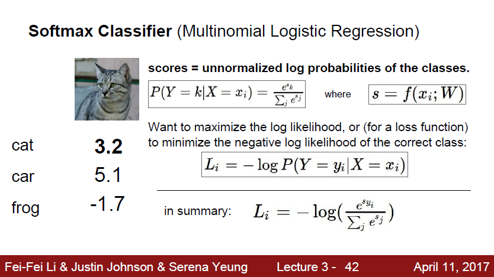
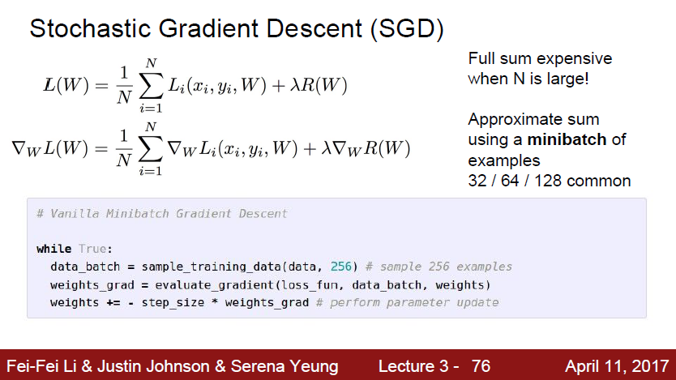

*해당 자료는 Stanford에서 제공하는 CS231n(2017)과 Lecture Note를 바탕으로 작성된 것임을 밝힙니다.*<br>

https://www.youtube.com/playlist?list=PL3FW7Lu3i5JvHM8ljYj-zLfQRF3EO8sYv

# Lecture 3. Loss Functions and Optimization

---

# 1. 손실 함수(loss function)

w를 입력으로 받아서 각 스코어를 확인하고 이 W가 지금 얼마나 거지같은지를 정량적으로 말해주는 것

### 1. Multiclass SVM loss


Q) At initialization W is small so all s = 0. What is the loss?<br>

A) (클래스의 수) - 1. Loss를 계산할 때 정답이 아닌 클래스를 순회한다. 그러면 C-1 클래스를 순회하게 된다. 비교하는 두 스코어가 거의 비슷하니 Margin 때문에 우리는 1 스코어를 얻게 될 것이다. 그리고 총 Loss는 C-1을 얻게 되는 것이다. 이는 실제로 '디버깅 전략'으로 유용하다. 이런 전략을 가지고 트레이닝을 처음 시작할 때 Loss가 C-1이 아니라면 아마 버그가 있는 것이고 고쳐야 할 것이다.

```python
def L_i_vectorized(x, y, W):
    scores = W.dot(x)
    margins = np.maximum(0, scores - scores[y] + 1)
    margins[y] = 0
    loss_i = np.sum(margins)
    return loss_i
```


### 2. 규제(Regularization)


* 모델이 더 복잡해지지 못하도록
* 모델에 soft penalty를 추가하도록
* "만약 너가 복잡한 모델을 계속 쓰고 싶으면, 이 penalty를 감수해야 할 거야!"


* L1: 분류기의 복잡도를가중치 W의 0의 개수에 따라 측정한다.
* L2: 분류기의 복잡도를 상대적으로 더 coarse한지(값이 매끄러운지)를 통해 측정한다.

### 3. Softmax Classifier(Multinomial Logistic Regression)



Q) At initialization W is small so all s = 0. What is the loss?<br>

A) -log(1/C) = log(C)가 되어야 한다. 마찬가지로 '디버깅 전략'으로 유용하다.<br>

*Note*<br>

SVM의 경우에는 일정 선(margins)을 넘기만 하면 더 이상 성능 개선에 신경쓰지 않는다. 반면 softmax는 정답 클래스는 무한대로, 그 외의 클래스는 음의 무한대로 보내려 하면서 더 좋게 성능을 높이려 할 것이다.<br>

# 2. 최적화(Optimization)

### 1. Random Search

```python
# assume X_train is the data where each column is an example(e.g. 3073 x 50,000)
# assume Y_train are the labels(e.g. ID array of 50,000)
# assume the function L evaluates the loss function

bestloss = float('inf')	# Python assigns the highest possible float value
for num in range(1000):
    W = np.random.randn(10, 3073) * 0.0001	# generate random parameters
    loss = L(X_train, Y_train, W)	# get the loss over the entire training set
    if loss < bestloss:	# keep track of the best solution
        bestloss = loss
        bestW = W
   	print('in attempt %d the loss was %f, best %f'%(num, loss, bestloss))
```

### 2. Gradient Descent

```python
# Vanilla Gradient Descent

while True:
    weights_grad = evaluate_gradient(loss_fun, data, weights)
    weights += - step_size * weights_grad	# perform parameter update
```

### 3. Stochastic Gradient Descent(SGD)



```python
# Vanilla Minibatch Gradient Descent

while True:
    data_batch = sample_training_data(data, 256)	# sample 256 examples
    weights_grad = evaluate_gradient(loss_fun, data_batch, weights)
    weights += - step_size * weights_grad	# perform parameter update
```
