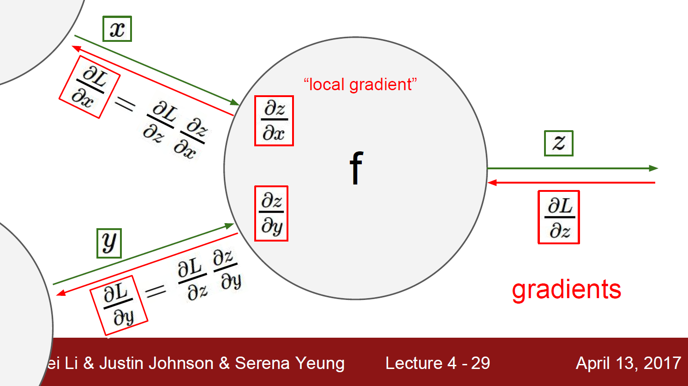
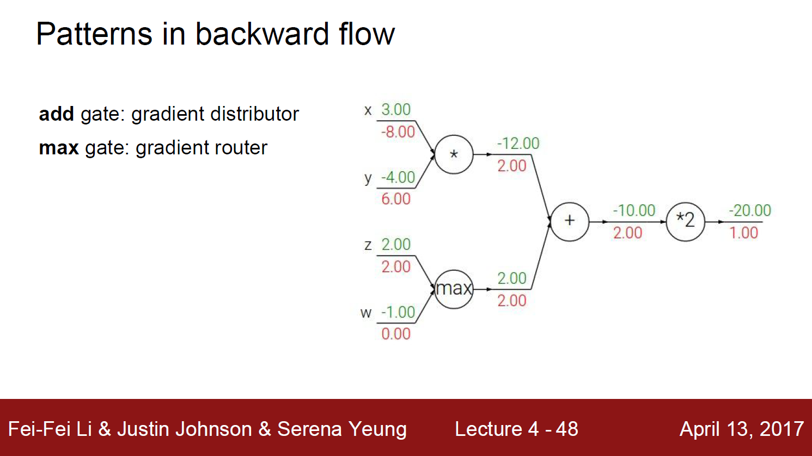
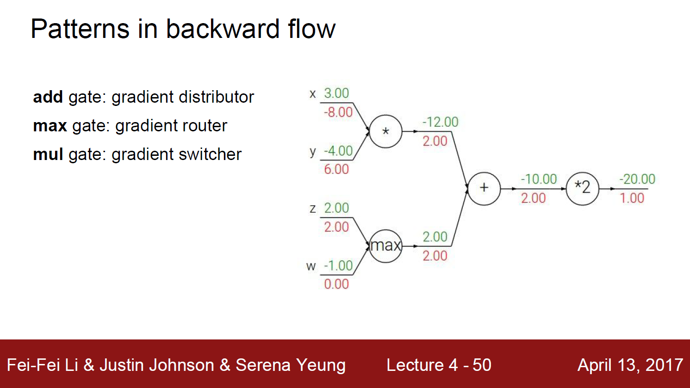
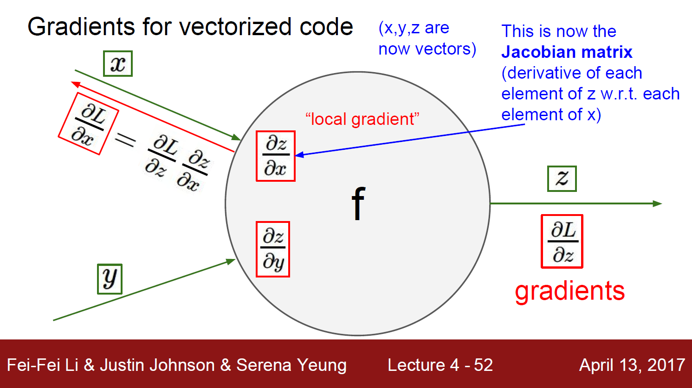

*해당 자료는 Stanford에서 제공하는 CS231n(2017)과 Lecture Note를 바탕으로 작성된 것임을 밝힙니다.*<br>

https://www.youtube.com/playlist?list=PL3FW7Lu3i5JvHM8ljYj-zLfQRF3EO8sYv

# Lecture 4. Introduction to Neural Networks


---


# 1. Backpropagation




gradient는 해당 변수가 최종 출력에 얼마나 영향을 미치는지를 정량화한다.


# 2. max gate




gradient가 단지 통과하는 효과를 가진다. 하나는 전체 값이, 다른 하나에서는 0의 gradient가 향하게 된다. 이것은 forward pass를 볼 때 의미가 있다. 최대값이 남은 computational graph로 통과된다. 그래서 결국 함수 계산에 실제로 영향을 주는 값은 유일한 값이므로, 따라서 gradient를 다시 전달할 때 무엇을 조정하고 계산의 해당 지점을 통해 흐르게 하는 것이 바람직하다.


# 3. mul gate




이것은 gradient switcher라고 생각할 수 있다.


```python
class MultiplyGate(object):
    def forward(x, y):
        z = x*y
        self.x = x	# must keep these around!
        self.y = y
        return z
    def backward(dz):
        dx = self.y * dz	# [dz/dx * dL/dz]
        dy = self.x * dz	# [dz/dy * dL/dz]
        return [dx, dy]
```


# 4. Backpropagation with vector




```python
class ComputationalGraph(object):
    # ...
    def forward(inputs):
        # 1. [pass inputs to input gates...]
        # 2. forward the computational graph:
        for gate in self.graph.nodes_topologically_sorted():
            gate.forward()
        return loss	# the final gate in the graph outputs the loss
    def backward():
        for gate in reversed(self.graph.modes_topologically_sorted()):
            gate.backward()	# little piece of backprop (chain rule applied)
        return inputs_gradients
```