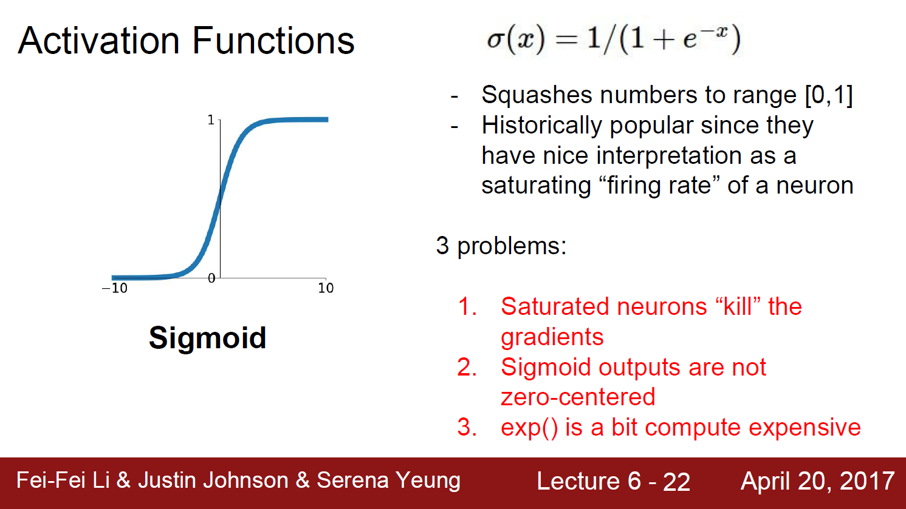
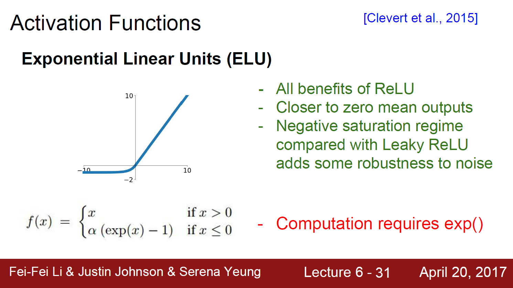

*해당 자료는 Stanford에서 제공하는 CS231n(2017)과 Lecture Note를 바탕으로 작성된 것임을 밝힙니다.*<br>

https://www.youtube.com/playlist?list=PL3FW7Lu3i5JvHM8ljYj-zLfQRF3EO8sYv

# Lecture 6. Training Neural Networks 1

---


# 1. Activation Functions

## 1. Sigmoid




sigmoid function의 output은 zero-centered 되어있지 않다. 위의 슬라이드의 예시와 같이, 만약 어떤 뉴런의 input이 항상 양수라고 가정하자. w의 gradient는 넘어온 dL/df(activation function)와 local gradient인 x를 곱해서 구할 수 있다. 따라서 w의 gradient의 부호는 넘어온 gradient의 부호에 따라 항상 양수이거나 음수가 된다. 이는 w가 모두 같은 방향으로만 움직일 것임을 의미한다. 파라미터를 업데이트 할 때마다 다 같이 증가하거나 다 같이 감소할 수 밖에 없다. 이러한 gradient 업데이트는 원하는 global minimum에 direct로 가지 못하고 zig zag path로 이동하기 때문에 매우 비효율적인 방법이라고 할 수 있다.


## 2. tanh


## 3. ReLU(Rectifier Linear Unit)


## 4. Leaky ReLU & PReLU(Parametric Rectifier Linear Unit)


## 5. ELU(Exponential Linear Units)




## 6. Maxout


In pratice:

* Use ReLU. Be careful with your learning rates
* Try out Leaky ReLU / Maxout / ELU
* Try out tanh but don't expect much
* Don't use sigmoid


# 2. Data Preprocessing


* zero-mean: 모든 뉴런이 positive 또는 negative인 gardient를 얻는 문제를 방지하기 위해 수행한다.
* normalization: 모든 차원이 동일한 범위 안에 있게 해줘서 전부 동등한 기여(contribute)를 하게 한다.
* 일반적으로 이미지의 경우 전처리로 zero-centering 정도만 해준다. normalization을 하지 않는 이유는 이미지의 각 차원간의 스케일이 어느 정도 맞춰져 있기 때문이다. 따라서 스케일이 다양한 여러 ML 문제와는 달리 이미지에서는 normalization을 엄청 잘 해 줄 필요는 없다.
* Machine Learning에서는 PCA나 whitening 같은 더 복잡한 전처리 과정도 있지만, 이미지에서는 단순히 zero-mean 정도만 사용하고 그 밖의 여러 복잡한 방법들은 잘 사용하지 않는다. 일반적으로 이미지를 다룰 때에는 굳이 입력을 더 낮은 차원으로 projection 시키지 않는다. CNN에서는 원본 이미지 자체의 spatial 정보를 이용해서 이미지의 spatial structure를 얻을 수 있도록 한다.


# 3. Weight initialization


## 1. what happens when W=0 init is used?

모든 뉴런이 전부 똑같은 일을 하게 될 것이다. 가중치가 0이라서 모든 뉴런은 모두 똑같은 연산을 수행한다. 출력도 모두 같고, 결국 gradient도 서로 같다. 결국 모든 가중치가 똑같은 값으로 업데이트된다. 이는 모든 뉴런이 모두 똑같이 생기도록 만든다. 모든 뉴런이 다 죽어버리지는 않는다.


## 2. What happens when W is small random numbers?

`W = 0.01 * np.random.randn(D, H)`와 같이 아주 작은 값(표준 편차 0.01)으로 W를 초기화 하는 방법도 생각해볼 수 있다. tanh activation function을 사용할 경우 이는 작은 네트워크에서는 잘 작동하지만, 네트워크가 깊어질수록 문제가 발생한다. 각 layer의 가중치가 너무 작기 때문에 forward pass에서는 layer가 깊어질수록 점점 더 작은 값을 다음 layer에 전달한다. 이후 backward pass 과정에서 W는 local gradient인 x가 곱해지며 가중치가 업데이트되는데, 해당 x값이 매우 작은 값들이기 때문에 결국 gradient도 작을 것이고, 이는 결국 업데이트가 잘 일어나지 않게 된다.


## 3. What happens when W is more bigger random numbers?

`W = 1.0 * np.random.randn(fan_in, fan_out)`와 같이 조금 더 큰 값(표준편차 1.0)으로 W를 초기화하면 어떻게 될까? tanh activation function을 사용할 경우 가중치가 큰 값을 가지므로 거의 모든 뉴런이 완전히 saturation되어, -1 또는 1의 값을 갖게 될 것이다. 결국  gradient는 0이 될 것이다.


## 4. Xavier initialization

```python
W = np.random.randn(fan_in, fan_out) / np.sqrt(fan_in)
```


## 5. He initialization

```python
W = np.random.randn(fain_in, fan_out) / np.sqrt(fan_in/2)
```

* ReLU activation을 가진 layer에서 유용한 기법
* ReLU는 출력의 절반을 죽인다. 그 절반은 매번 0이 된다. 그래서 결국 출력의 분산을 반토막 내버린다. 그러므로 Xavier initialization을 사용하면 값이 너무 작아져 잘 작동하지 않는다. 따라서 2를 나눠주는 연산을 추가함으로써 이를 해결했다.


## 6. Hyperparameter Optimization


