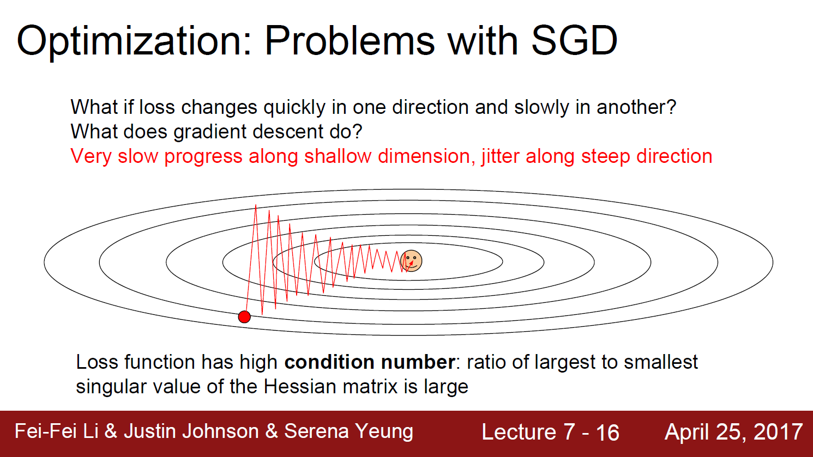
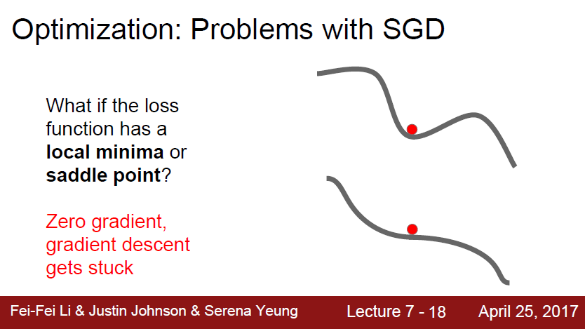
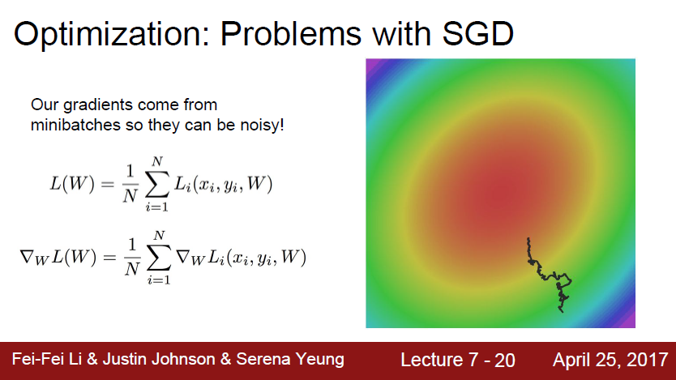
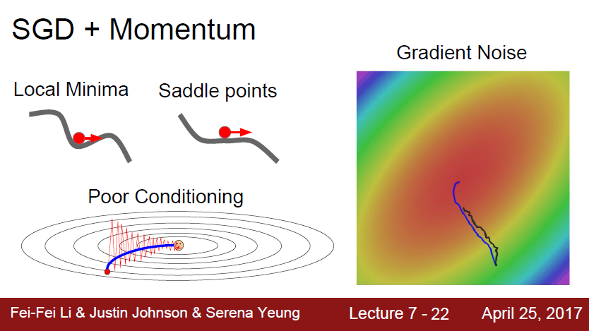
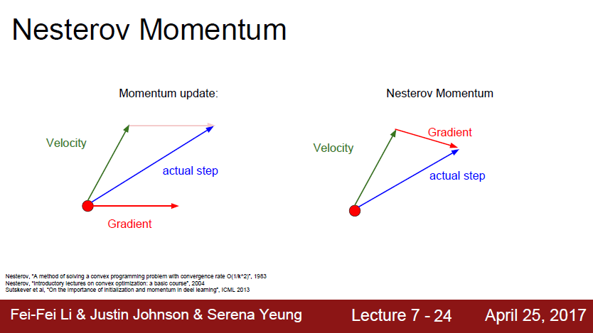
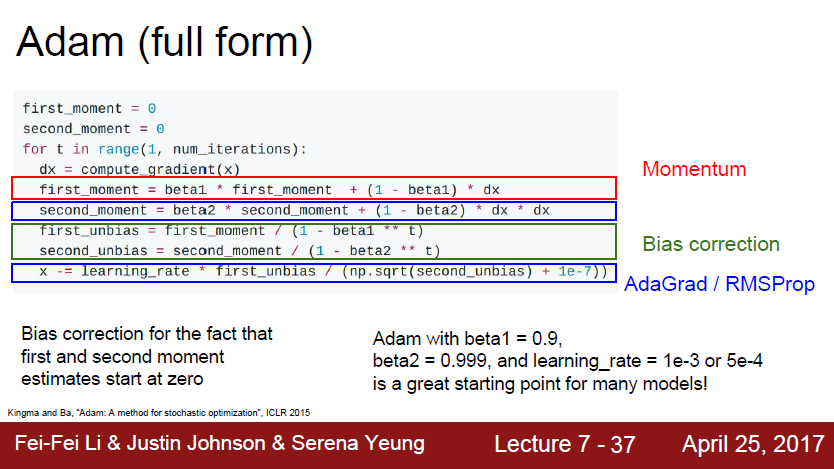
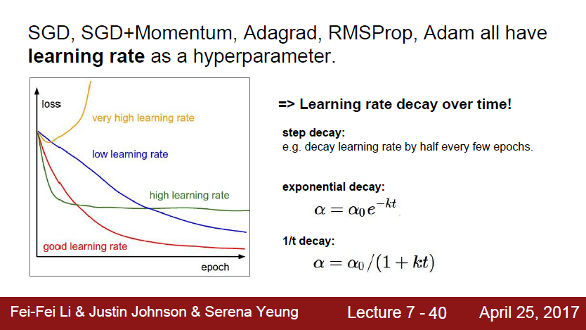

*해당 자료는 Stanford에서 제공하는 CS231n(2017)과 Lecture Note를 바탕으로 작성된 것임을 밝힙니다.*<br>

https://www.youtube.com/playlist?list=PL3FW7Lu3i5JvHM8ljYj-zLfQRF3EO8sYv

# Lecture 7. Training Neural Networks 2


# 1. Fancier Optimization

## 1. SGD(Stochastic Gradient Descent)

```python
# Vanilla Gradient Descent

while True:
    weights_grad = evaluate_gradient(loss_fun, data, weights)
    weights += - step_size * weights_grad	# perform parameter update
    
# while True:
#     dx = compute_gradient(x)
#     x += learning_rate * dx
```




* 위와 같은 문제는 고차원 공간에서 훨씬 더 빈번하게 발생한다. 위의 그림은 2차원밖에 되지 않지만 실제로는 파라미터가 수천, 수억 개 일 수 있다. 이 경우 수억개의 방향으로 움직일 수 있다. 이런 수억 개의 방향 중에 불균형한 방향이 존재한다면 SGD는 잘 동작하지 않을 것이다. 수억 개의 파라미터가 있다고 했을 때 이런 불균형의 발생 비율은 상당히 높다. 고차원 공간에서 발생할 수 있는 이런 문제는 실제로도 정말 큰 문제가 된다.





* Zero gradient, gradient descent gets stuck
* Saddle points much more common in high dimension
* 위의 그림처럼 1차원의 예제만 봐서는 local minima가 매우 심각하고 saddle point는 좀 덜 심각해 보이지만, 고차원 공간에서는 그 반대이다. 만약에 우리에게 1억 차원의 공간이 있다고 생각해보자. 여기에서 saddle point는 무엇일까? saddle point가 의미하는 것이 어떤 방향은 loss가 증가하고 다른 몇몇 방향은 loss가 감소하고 있는 곳을 생각해 볼 수 있다.  1억 개의 차원에서 생각해보면 이는 정말 빈번하게 발생한다. 사실 거의 모든 곳에서 발생한다고 할 수 있다. 지난 몇 년간 알려진 사실은 very large neural network에서 local minima보다는 saddle point에 취약하다는 것이다. 그리고 또한 saddle point 뿐만 아니라 saddle point의 근처에서도 문제는 발생한다. 위 그림에서도 saddle point 근처에서 gradient가 0은 아니지만 기울기가 아주 작다. 이것이 의미하는 바는 gradient를 계산해서 업데이트를 해도 기울기가 아주 작기 때문에 현재 가중치의 위치가 saddle point 근처라면 업데이트는 아주 느리게 진행됩니다.





*discussion*<br>

SGD를 쓰지 않고 GD를 쓴다면 문제가 해결되는 것인가? 정답은 그렇지 않다. full batch gradient descent에서도 같은 문제가 발생한다. 위와 같은 위험요소들을 다루기 위해서는 더 좋은 최적화 알고리즘이 필요하다.


## 2. SGD + Momentum

```python
vx = 0
while True:
    dx = compute_gradient(x)
    vx = rho * vx + dx
    x += learning_rate * vx
```




## 3. Nesterov Momentum




* 빨간 점에서 시작해서 우선 velocity 방향으로 움직인다. 그리고 그 지점에서의 gradient를 계산한다. 그리고 다시 원점으로 돌아가서 둘을 합친다. 두 정보를 약간 더 섞어주는 아이디어이다. velocity의 방향이 잘못되었을 경우에 현재 gradient의 방향을 좀 더 활용할 수 있도록 해준다.
* Nesterov는 convex optimization 문제에서는 뛰어난 성능을 보이지만, neural network와 같은 non-convex problem에서는 성능이 보장되지는 않는다.


## 4. AdaGrad

```python
# Added element-wise scaling of the gradient based on the historical sum of squares in each dimension

grad_squared = 0
while True:
    dx = compute_gradient(x)
    grad_squared += dx * dx
    x -= learning_rate * dx / (np.sqrt(grad_squared) + 1e-7)
```

Q. What happens with AdaGrad?<br>

2차원 좌표가 있다고 가정하자. 그 중 한 차원은 항상 gradient가 높은 차원이고, 다른 하나는 항상 작은 gradient를 가진다. 작은 gradient를 가지는 차원에서는 gradient의 제곱 값 합이 작다. 이 작은 값이 나눠지므로 가속도가 붙게 된다. 반면에 큰 gradient를 가지는 차원에서는 gradient의 제곱 값 합이 크기 때문에 큰 값이 나눠지게 된다. 그러므로 속도가 점점 줄어든다.<br>

<br>


Q. What happens to the step size over long time?<br>

AdaGrad는 step을 진행할수록 값이 점점 작아진다. update동안 gradient의 제곱이 계속해서 더해진다. 때문에 이 값(estimate)은 서서히(monotonically) 증가하게 된다. 이는 step size를 점점 더 작은 값이 되게 한다. 손실 함수가 convex한 경우에 점점 작아지는 것은 정말 좋은 특징이 될 수 있다. convex case에서는 minimum에 근접하면 서서히 속도를 줄여서 수렴할 수 있게 하면 좋을 것이다. 하지만 non-convex case에서는 문제가 될 수 있다. 가령 saddle point에 걸려버렸을 때 AdaGrad는 멈춰버릴 수 있다.


## 5. RMSProp

```python
# decay_rate = 0.9 or 0.99
grad_squared = 0
while True:
    dx = compute_gradient(x)
    grad_squared = decay_rate * grad_squared + (1 - decay_rate) * dx * dx
    x -= learning_rate * dx / (np.sqrt(grad_squared) + 1e-7)
```


## 6. Adam




# 2. Learning Rate




* learning rate를 언제 낮춰야 하는지를 생각해보자. 현재 수렴을 잘 하고 있는 상황에서 gradient가 점점 작아지고 있는 상황을 가정할 때, learning rate가 너무 높아서 더 깊게 들어가지 못할 수도 있다. 이 상황에서 learning rate를 낮추게 되면 속도가 줄어들 것이고 지속해서 loss를 줄일 수 있을 것이다.
* learning rate decay는 Adam보다는 SGD Momentum을 사용할 때 자주 쓴다.
* learning rate decay는 부차적인(second-order) 하이퍼파라미터이다. 일반적으로 learning rate decay를 학습 초기부터 고려하지는 않는다. 보통 학습 초기에는 learning rate decay가 없다고 생각하고 learning rate를 잘 선택하는 것이 중요하다. learning rate와 decay 등을 cross-validate하려고 한다면 문제가 너무 복잡해진다.
* learning rate decay를 설정하는 순서는, 우선 decay 없이 학습을 시켜본다. 그리고 loss curve를 잘 살피고 있다가 decay가 필요한 곳이 어디인지 고려해 보는 것이 좋다.

47:15~