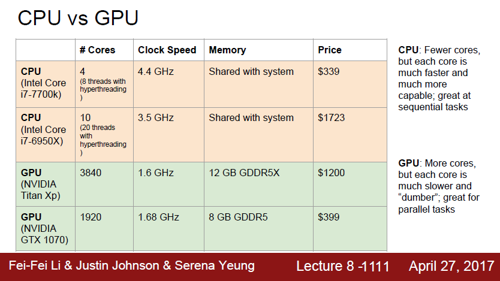
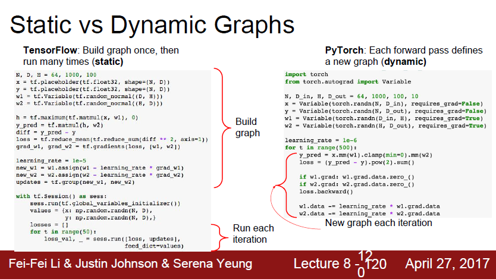

*해당 자료는 Stanford에서 제공하는 CS231n(2017)과 Lecture Note를 바탕으로 작성된 것임을 밝힙니다.*<br>

https://www.youtube.com/playlist?list=PL3FW7Lu3i5JvHM8ljYj-zLfQRF3EO8sYv

# Lecture 8. Deep Learning Software

# 1. CPU vs GPU




## 1. CPU

* Central Processing Unit
* core의 수가 적다. 상업용 데스크탑 CPU의 경우에 코어가 4개에서 6개, 조금 많으면 10개 정도이다. 그리고 hyperthreading 기술과 더불어 CPU는 8~20개의 스레드를 동시에 실행시킬 수 있다. 따라서 CPU는 한 번에 20가지의 일(스레드)을 할 수 있는 것이다. 또한 이러한 일은 독립적으로 수행한다.
* CPU에도 캐시가 있지만 비교적 작다. CPU는 대부분의 메모리를 RAM에서 끌어다 쓴다.
* CPU는 범용 처리에 적합하다.


## 2. GPU

* Graphics Processing Unit
* 고성능의 상업 GPU의 경우 수천개의 코어가 있다. NVIDIA Titan XP와 같은 최상의 모델의 경우 3840개의 코어가 있다. 하지만 GPU의 단점은 각각의 코어가 더 느린 clock speed에서 동작한다. 또한 그 코어들이 그렇게 많은 일을 할 수 없다. GPU 코어들은 독립적으로 동작하지 않는다. 코어마다 독립적인 테스크가 있는 것이 아니라 많은 코어들이 하나의 테스크를 병렬적으로 수행하는 것이다. 즉 GPU의 코어의 수가 많다는 것은 어떤 테스크가 있을 때 이 일을 병렬적으로 수행하기 아주 적합하다는 것을 알 수 있다. 하지만 그 테스크는 전부 같은 테스크여야 할 것이다.
* GPU는 칩 안에 RAM이 내장되어 있다. RAM과 GPU간의 통신은 상당한 bottleneck을 초래하기 때문에 GPU는 보통 칩에 RAM이 내장되어 있는 구조로 존재한다. 
* GPU는 병렬 처리에 더 특화되어 있다.
* GPU에서 정말 잘 동작하고 아주 적합한 알고리즘은 바로 행렬곱(Matrix multiplication) 연산이다.
* GPU로 학습을 할 때 생기는 문제 중의 하나는, model과 model의 가중치는 전부 GPU RAM에 상주하고 있는 반면에 실제 train data(Big data)는 SSD와 같은 하드드라이브에 있다는 것이다.


# 3. Deep Learning Framework(Pytorch)

## 1. Tensors

* Pytorch Tensors are just like numpy arrays, but they can run on GPU.
* No built-in notion of computational graph, or gradients, or deep learning.
* Here we fit a two-layer net using Pytorch Tensors:

```python
import torch

dtype = torch.FloatTeonsor # CPU
dtype = torch.cuda.FloatTensor # GPU

# Create random tensors for data and weights
N, D_in, H, D_out = 64, 1000, 100, 10
x = torch.randn(N, D_in).type(dtype)
y = torch.randn(N, D_out).type(dtype)
w1 = torch.randn(D_in, H).type(dtype)
w2 = torch.randn(H, D_out).type(dtype)

learning_rate = 1e-6
for t in range(500):
    # Forward pass: compute predictions and loss
    h = x.mm(w1)
    h_relu = h.clamp(min=0)
    y_pred = h_relu.mm(w2)
    loss = (y_pred - y).pow(2).sum()
    
    # Backward pass: manually compute gradients
    grad_y_pred = 2.0 * (y_pred = y)
    grad_w2 = h_relu.t().mm(grad_y_pred)
    grad_h_relu = grad_y_pred.mm(w2.t())
    grad_h = grad_h_relu.clone()
    grad_h[h < 0] = 0
    grad_w1 = x.t().mm(grad_h)
    
    # Gradient descent step on weights
    w1 -= learning_rate * grad_w1
    w2 -= learning_rate * grad_w2
```


## 2. Autograd

* A Pytorch Variable is a node in a computational graph
* x.data is a tensor
* x.grad is a Variable of gradients(same shape as x.data)
* x.grad.data is a Tensor of gradients
* Pytorch Tensors and Variables have the same API!
* Variables remember how they were created(for backprop)


```python
import torch
from torch.autograd import Variable

N, D_in, H, D_out = 64, 1000, 100, 10
# We will not want gradients(of loss) with respect to data
x = Variable(torch.randn(N, D_in), requires_grad=False)
y = Variable(torch.randn(N, D_out), requires_gard=False)
# Do want gradients with respect to weights
w1 = Variable(torch.randn(D_in, H), requires_grad=True)
w2 = Variable(torch.randn(H, D_out), requires_grad=True)

learning_rate = 1e-6
for t in range(500):
    # Forward pass looks exactly the same as the Tensor version,
    # but everything is a variable now
    y_pred = x.mm(w1).clamp(min=0).mm(w2)
    loss = (y_pred - y).pow(2).sum()
    
    # Compute gradient of loss with respect to w1 and w2(zero out grads firsts)
    if w1.grad: w1.grad.data.zero_()
    if w2.grad: w2.grad.data.zero_()
    loss.backward()
    
    # Make gradient step on weights
    w1 -= learning_rate * w1.grad.data
    w2 -= learning_rate * w2.grad.data
```


## 3. New Autograd Functions

* Define your own autograd functions by writing forward and backward for Tensors


```python
class ReLU(torch.autograd.Function):
    def forward(self, x):
        self.save_for_backward(x)
        return x.clamp(min=0)
    
    def backward(self, grad_y):
        x, = self.saved_tensors
        grad_input = grad_y.clone()
        grad_input[x < 0] = 0
        return grad_input
    

N, D_in, H, D_out = 64, 1000, 100, 10
x = Variable(torch.randn(N, D_in), requires_grad=False)
y = Variable(torch.randn(N, D_out), requires_gard=False)
w1 = Variable(torch.randn(D_in, H), requires_grad=True)
w2 = Variable(torch.randn(H, D_out), requires_grad=True)

learning_rate = 1e-6
for t in range(500):
    relu = ReLU()
    y_pred = relu(x.mm(w1)).mm(w2)
    loss = (y_pred - y).pow(2).sum()
    
    if w1.grad: w1.grad.data.zero_()
    if w2.grad: w2.grad.data.zero_()
    loss.backward()

    w1 -= learning_rate * w1.grad.data
    w2 -= learning_rate * w2.grad.data
```


## 4. nn

* Higher-level wrapper for working with neural nets
* Similar to Keras and friends... but only one, it's good


```python
import torch
from torch.autograd import Variable

N, D_in, H, D_out = 64, 1000, 100, 10
x = Variable(torch.randn(N, D_in))
y = Variable(torch.radnn(N, D_out), requires_grad=False)

# Define our model as a sequence of layers
model = torch.nn.Sequential(
			torch.nn.Linear(D_in, H),
			torch.nn.ReLU(),
    		torch.nn.Linear(H, D_out))
# nn also defines common loss functions
loss_fn = torch.nn.MSELoss(size_average=False)

learning_rate = 1e-4
for t in range(500):
    # Forward pass: feed data to model, and prediction to loss function
    y_pred = model(x)
    loss = loss_fn(y_pred, y)
    
    # Backward pass: compute all gradients
    model.zero_grad()
    loss.backward()
    
    # Make gradient step on each model parameter
    for param in model.parameters():
        param.data -= learning_rate * param.grad.data
```


## 5. optim

```python
import torch
from torch.autograd import Variable

N, D_in, H, D_out = 64, 1000, 100, 10

x = Variable(torch.randn(N, D_in))
y = Variable(torch.randn(N, D_out), requires_grad=False)

model = torch.nn.Sequential(
			torch.nn.Linear(D_in, H),
			torch.nn.ReLU(),
			torch.nn.Linear(H, D_out))
loss_fn = torch.nn.MSELoss(size_average=False)

learing_rate = 1e-4
# Use an optimizer for different update rules
optimizer = torch.optim.Adam(model.parameters(),
                            lr=learing_rate)
for t in range(500):
    y_pred = model(x)
    loss = loss_fn(y_pred, y)
    
    optimizer.zero_grad()
    loss.backward()
    
    # Update all parameters after computing gradients
    optimizer.step()
```


## 6. Define new Modules

* A Pytorch Module is a neural net layer; it inputs and outputs Variables
* Modules can contain weights(as Variables) or other Modules
* You can define your own Modules using autograd!


```python
import torch
from torch.autograd import Variable

# Define our whole model as a single Module
class TwoLayerNet(torch.nn.Module):
    # initializer sets up two children(Modules can contain modules)
    def __init__(self, D_in, H, D_out):
        super(TwoLayerNet, self).__init__()
        self.linear1 = torch.nn.Linear(D_in, H)
        self.linear2 = torch.nn.Linear(H, D_out)
        
    # Define forward pass using child modules and autograd ops on Variables
    # No need to define backward - autograd will handle it
    def forward(self, x):
        h_relu = self.linear1(x).clamp(min=0)
        y_pred = self.linear2(h_relu)
        return y_pred
    
N, D_in, H, D_out = 64, 1000, 100, 10

x = Variable(torch.randn(N, D_in))
y = Variable(torch.randn(N, D_out), requires_grad=False)

# Construct and train an instance of our model
model = TwoLayerNet(D_in, H, D_out)

criterion = torch.nn.MSELoss(size_average=False)
optimizer = torch.optim.SGD(model.paramters(), lr=1e-4)
for t in range(500):
    y_pred = model(x)
    loss = criterion(y_pred, y)
    
    optimizer.zero_grad()
    loss.backward()
    optimizer.step()
```


## 7. DataLoaders

* A DataLoader wraps a Dataset and provides minibatching, shuffling, multithreading, for you
* When you need to load custom data, just write your own Dataset class


```python
import torch
from torch.autograd import Variable
from torch.utils.data import TensorDataset, DataLoader

N, D_in, H, D_out = 64, 1000, 100, 10

x = torch.randn(N, D_in)
y = torch.randn(N, D_out)

loader = DataLoader(TensorDataset(x, y), batch_size=8)

model = TwoLayerNet(D_in, H, D_out)

criterion = torch.nn.MSELoss(size_average=False)
optimizer = torch.optim.SGD(model.parameters(), lr=1e-4)

# Iterate over loader to form minibatches
# Loader gives Tensors so you need to wrap in Variables
for epoch in range(10):
    for x_batch, y_batch in loader:
        x_var, y_var = Variable(x_batch), Variable(y_batch)
        y_pred = model(x_var)
        loss = criterion(y_pred, y_var)
        
        optimizer.zero_grad()
        loss.backward()
        optimizer.step()
```


## 8. Pretrained Models

* Super easy to use pretrained models with torchvision
* Reference) https:github.com/pytorch/vision


```python
import torch
import torchvisoin

alexnet = torchvision.models.alexnet(pretrained=True)
vgg16 = torchvision.models.vgg16(pretrained=True)
resnet101 = torchvision.models.resnet101(pretrained=True)
```


## 9. Visdom

* Somewhat similar to TensorBoard: add logging to your code, then visualized in a browser
* Can't visualize computational graph structure


# 4. Static vs Dynamic Graphs

