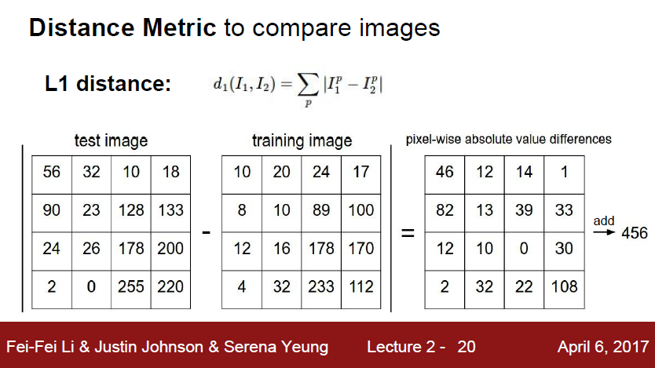
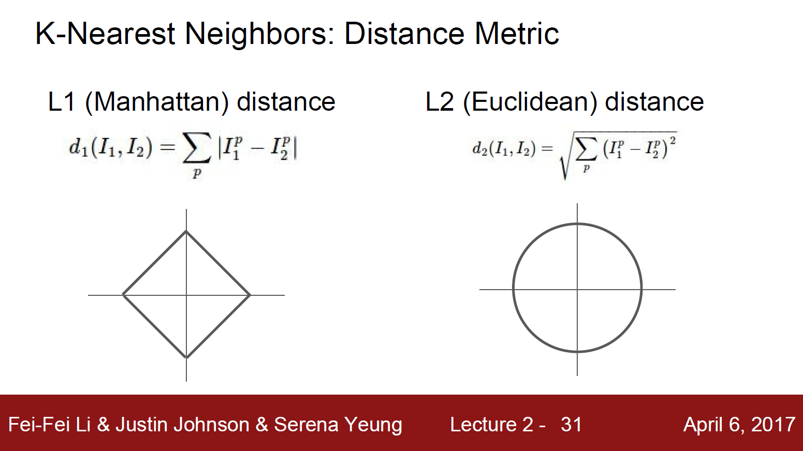
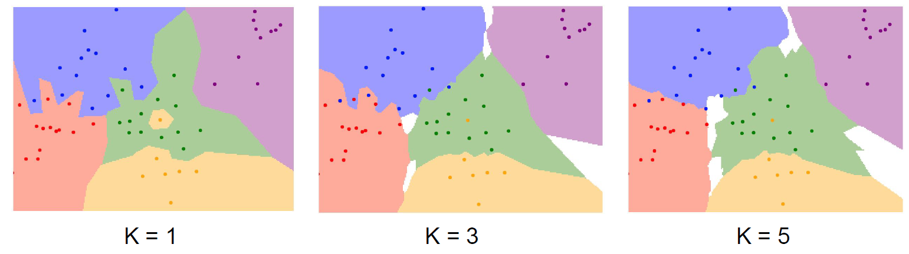
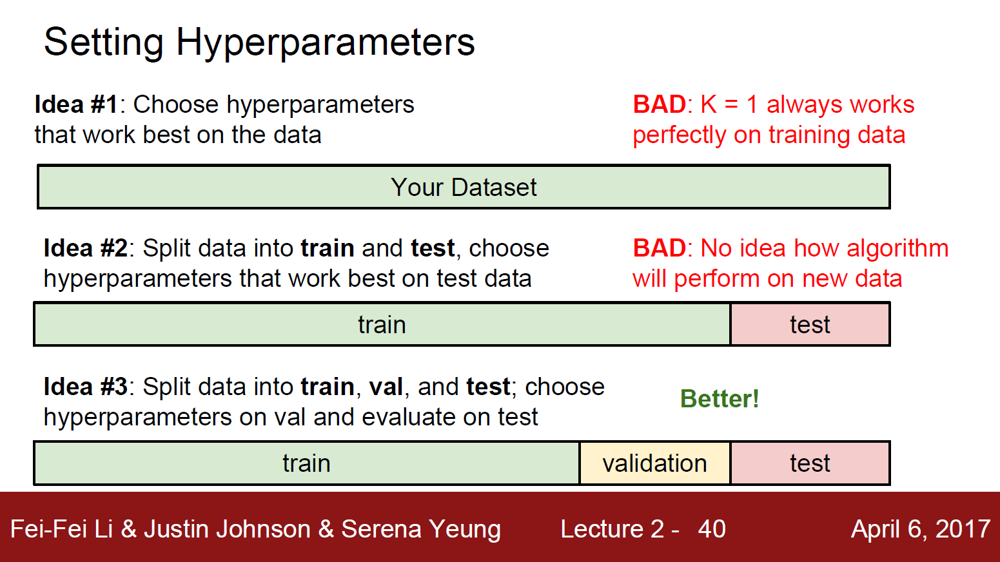
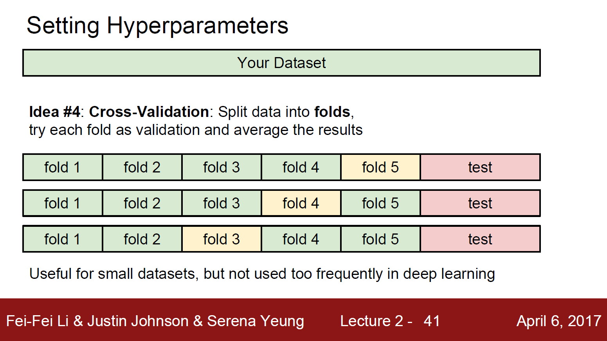
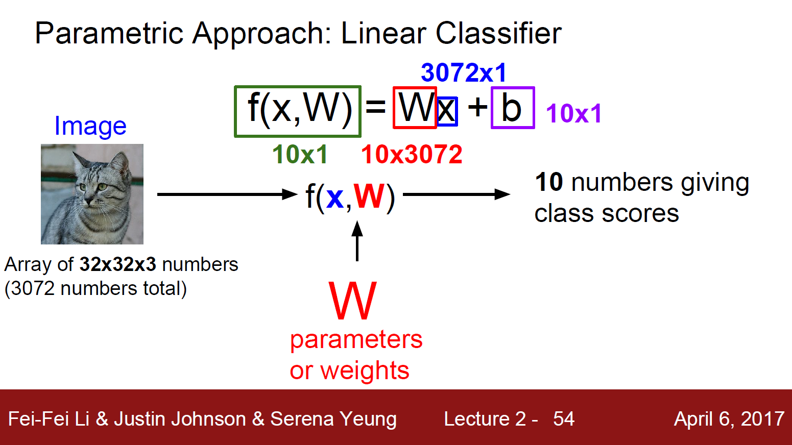

*해당 자료는 Stanford에서 제공하는 CS231n(2017)과 Lecture Note를 바탕으로 작성된 것임을 밝힙니다.*<br>

https://www.youtube.com/playlist?list=PL3FW7Lu3i5JvHM8ljYj-zLfQRF3EO8sYv

# Lecture 2. Image Classification

---

# 1. What is challenges of Vision?

* Viewpoint variation(카메라에 담긴 물체의 위치)
* Illumination(밝기)
* Deformation(자세)
* Occlusion(가려짐)
* Background Clutter(배경과 유사)
* Intraclass variation(물체의 다양한 모습)


# 2. Nearest Neighbor

### 1. Data-driven Approach

```python
# Memorize all data and labels
def train(images, labels):
    # Machine Learning!
    return model

# Predict the label of the most similar training image
def predict(model, test_images):
    # Use model to predict labels
    return test_labels
```

### 2. 이미지 쌍이 있을 때 어떻게 비교를 할 것인가?(=어떤 비교 함수를 사용할 것인가?)





1. L1: 어떤 좌표 시스템이냐에 따라 많은 영향
   * 기존의 좌표계를 회전시키면 L1 distance가 변한다.
   * 특정 벡터의 각각 요소들이 개별적인 의미를 가지고 있는 경우(ex. 키, 몸무게) 적절

2. L2: 좌표 시스템과 연관 X
   * 특정 벡터가 일반적인 벡터이고, 요소들간의 실질적인 의미를 잘 모르는 경우

### 3. python code

```python
import numpy as np

class NearestNeighbor:
    def __init__(self):
        pass
    
    def train(self, X, y):
        """X is N x D where each row is an example. Y is 1-dimension of size N"""
        # the nearest neighbor classifier simply remembers all the training data
        self.Xtr = X
        self.ytr = y
        
    def predict(self, X):
        """X is N x D where each row is an example we wish to predict label for"""
        num_test = X.shape[0]
        # let's make sure that the output type matches the input type
        Ypred = np.zeros(num_test, dtype=self.ytr.dtype)
        
        # loop over all test rows
        for i in range(num_test):
            # find the nearest training image to the i'th test image
            # using the L1 distance(sum of absolute value differences)
            distances = np.sum(np.abs(self.Xtr - X[i,:]), axis=1)
            min_index = np.argmin(distances)	# get the index with smallest distance
            Ypred[i] = self.ytr[min_index]		# predict the label of the nearest example
            
            return Ypred
```

### 4. With N examples, how fast are training and prediction?

* Train O(1), predict O(N)
* This is bad: we want classifiers that are fast at prediction; slow for training is ok


# 3. K-Nearest Neighbors

### 1. Instead of copying label from nearest neighbor, take **majority vote** from K closest points.



### 2. K가 1보다 커야 결정 경계가 더 부드러워지고 더 좋은 결과를 보인다(각종 잡음들에 조금 더 강인해진다).

### 3. Setting Hyperparameters





* Cross-Validation은 표준이긴 하지만, 실제로는 딥러닝 같은 큰 모델을 학습시킬 때는 학습 자체가 계산량이 많기 때문에 실제로는 잘 쓰지 않는다.

### 4. K-Nearest Neighbor on image.s never used

1. Very slow at test time
2. Distance metrics on pixels are not informative.

3. Curse of dimensionality(차원의 저주): 공간을 조밀하게 덮으려면 충분한 량의 학습 데이터가 필요하고, 그 양은 차원이 증가함에 따라 기하급수적으로 증가한다. 고차원의 이미지라면 모든 공간을 조밀하게 메울 만큼의 데이터를 모으는 일은 현실적으로 불가능하다.


# 4. Linear Classification

