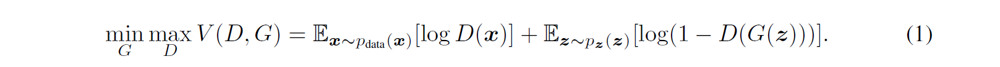
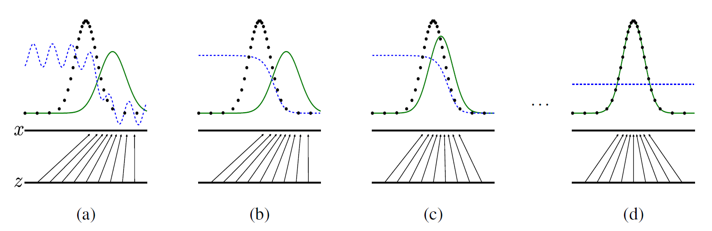
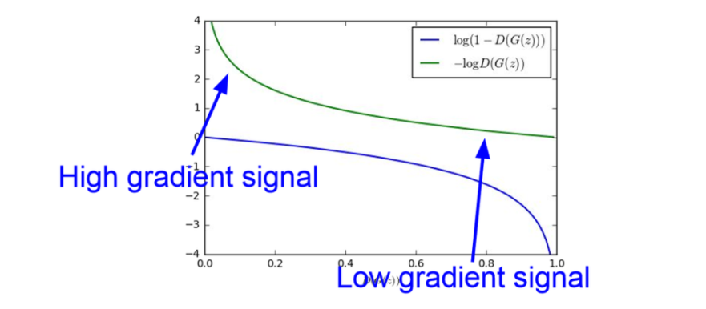
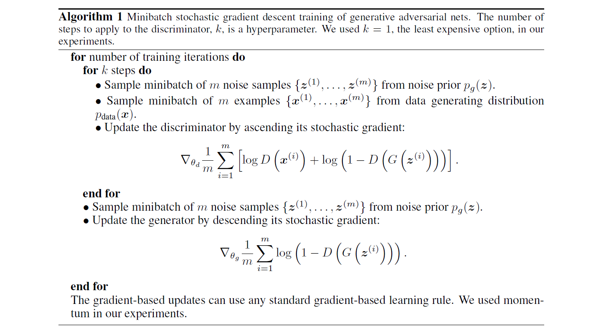

# Generative Adversarial Nets

Paper) https://arxiv.org/abs/1406.2661<br>
Reference) GAN: Generative Adversarial Networks (꼼꼼한 딥러닝 논문 리뷰와 코드 실습) [[link]](https://www.youtube.com/watch?v=AVvlDmhHgC4)

---

# Abstract

*a generative model G that captures the data distribution, and a discriminative model D that estimates the probability that a sample came from the training data rather than G.*<br>
GAN은 data의 분포를 학습하는 G(생성자)와 data가 real인지(실제 데이터인지) fake인지(G로부터 생성되었는지)를 추정하는 D(판별자)로 이루어진 개념이다.


# 1. Introduction

*In the proposed adversarial nets framework, the generative model is pitted against an adversary: a discriminative model that learns to determine whether a sample is from the model distribution or the data distribution.*<br>
GAN은 G와 D가 적대적으로 학습한다. D는 특정 샘플이 data distribution에서 추출된 것인지(real), model distribution에서 추출된 것인지(fake) 잘 구분하는 방향으로 학습한다. 반면에 G는 model distribution으로 데이터를 생성하여 D가 real이라고 인식하게끔 하는 방향으로 학습한다. 즉, G의 model distribution은 data distribution과 유사한 방향으로 학습이 이루어진다.<br>
<br>

또한 저자는 GAN의 방법이 기존의 approximate inference나 Markov chain 기법을 적용하지 않고, 오직 multilayer preceptron으로 모델을 구성했다는 점을 강조한다.<br>


# 2. Realted work

GAN 모델이 발표되기 전에 해당 분야에 대한 연구 현황을 나타내고 있다. 이 분야에 대한 background가 부족하여 skip한다.


# 3. Adversarial nets



위 수식에 대한 설명은 GAN Report에서 이미 다룬 바 있으므로, 그 내용을 그대로 차용함을 밝힌다.

* GAN(G + D)을 학습하여 궁극적으로 사용하고자 하는 모델은 G이며, D는 G가 잘 학습할 수 있도록 도와주는 역할을 한다.
* x~pdata(x): 원본 데이터의 분포에서 하나의 데이터 x를 샘플링
* z~pz(z): 노이즈 데이터의 분포에서 하나의 데이터 z를 샘플링
* E: 기댓값으로써, 프로그램상에서는 단순히 모든 데이터를 하나씩 확인하여 식에 대입한 뒤에 평균을 계산
* V(D, G)에 대하여 G는 이 값을 minimize하려고 하고, D는 maximize하려고 한다. 이러한 목표를 봤을 때 G와 D 각각은 V(D, G)를 어떤 방향으로 이끌어가는지 생각하는 것이 중요하다.
* D 관점에서 봤을 때, logD(x)를 maximize하려고 하므로 D(x)는 1에 가까운 값을 얻으려고 할 것이다. 또한 log(1-D(G(z)))를 maximize하려고 하므로 1-D(G(z))는 1에 가까운 값 즉, D(G(z))는 0에 가까운 값을 얻으려고 할 것이다. 이를 해석하자면 D는 x를 실제(Real)라고 잘 분류하고, G(z)(G가 z를 통해 만든 가짜 데이터)를 가짜(Fake)라고 잘 분류하도록 학습이 된다.
* G 관점에서 봤을 때, log(1-D(G(z)))를 minimize하려고 하므로 1-D(G(z))는 0에 가까운 값 즉, D(G(z))는 1에 가까운 값을 얻으려고 할 것이다. 이를 해석하자면 G는 z를 통해 생성한 데이터를 D가 실제(Real)라고 잘 분류하도록 학습이 된다. 즉, 가짜 데이터셋을 잘 만들도록 학습이 된다.

<br>



논문의 저자는 GAN의 학습 과정을 쉽게 이해하도록 하기 위해 위와 같은 그림을 제시한다.

* z는 uniform distribution이나 gaussian distribution과 같은 임의의 분포(noise distribution)이고, x는 기존 dataset(domain)의 영역이다.
* z에서 x로 매핑하는 과정을 G가 담당한다.
* 검정색 점의 분포는 기존 dataset의 distribution을 의미한다.
* 초록색 선의 분포는 G가 만들어낸 dataset의 distribution을 의미한다.
* 이 때 기존 dataset은 무한이 아니기 때문에 '점'으로 표현하고, 반면에 G가 만들어내는 dataset은 연속적으로 만들어낼 수 있기 때문에 '선'으로 표현한다.
* 파란색 선은 D가 특정 dataset point를 기존 dataset의 distribution에서 추출한 것이라고 판별하는 estimation을 의미한다.


학습을 시작하기 전에는 (a)와 같은 형태를 띤다. G가 학습되지 않은 단계이기 때문에, D는 어느 정도 예측을 하는 수준임을 확인할 수 있다. 먼저 D를 학습하는 과정을 거치는데, 이를 통해 D는 특정 dataset point가 어떤 distribution에서 도출된 것인지(real or fake) 잘 판별하게 되어 (b)와 같은 형태로 바뀐다. 이후 G를 학습하면, G의 model distribution이 점점 data distribution과 유사하지기 때문에 (c)와 같은 형태를 띤다. D와 G의 학습 과정을 지속적으로 반복하면, G는 더더욱 실제 data와 유사한 data를 생성해내기 때문에 결국 D의 추정은 항상 1/2를 도출한다. (d)가 이에 해당한다.<br>
<br>


*discussion*<br>
학습이 진행될수록 G는 목표를 달성해가지만 D는 그렇지 못한다는 것을 알 수 있다. 이는 수학적 수식에 의해 증명된 사실이기 때문이다.<br>
<br>


*Optimizing D to completion in the inner loop of training is computationally prohibitive, and on finite dataset would result in overfitting. Instead, we alternate between k steps of optimizing D and one step of optimizing G. This results in D being maintained near its optimal solution, so long as G changes slowly enough.*<br>
Question) 이해 필요<br>
<br>


*Rather than training G to minimize log(1 - D(G(z))) we can train G to maximize logD(G(z)). This objective function results in the same fixed point of the dynamics of G and D but provides much stronger gradients early in learning.*<br>

G를 학습할 때 log(1 - D(G(z)))를 최소화하는것보다 log(D(G(z))를 최대화하는 방향으로 설정하는 것이, 학습 초기에 더 높은 gradient를 가질 수 있기 때문에 성능이 더 좋을 수 있다는 것을 실험적으로 발견한 내용을 언급한다. 이와 관련된 설명을 한 블로그에서 찾을 수 있었다. 발췌한 내용은 아래와 같다.<br>

```
논문에서 한 가지 실용적인 tip이 나오는데, 위에 value function에서 log(1−D(G(z))) 부분을 G에 대해 minimize하는 대신 log(D(G(z)))를 maximize하도록 G를 학습시킨다는 것입니다.

나중에 저자가 밝히 듯이 이 부분은 전혀 이론적인 동기로부터 수정을 한 것이 아니라 순수하게 실용적인 측면에서 적용을 하게 된 것이라 합니다.

이유도 아주 직관적인데 예를 들어 학습 초기를 생각해보면, G가 초기에는 아주 이상한 image들을 생성하기 때문에 D가 너무도 쉽게 이를 real image와 구별하게 되고 따라서 log(1−D(G(z))) 값이 매우 saturate하여 gradient를 계산해보면 아주 작은 값이 나오기 때문에 학습이 엄청 느립니다.

하지만 문제를 G=argmaxG log(D(G(z)))로 바꾸게 되면, 초기에 D가 G로 나온 image를 잘 구별한다고 해도 위와 같은 문제가 생기지 않기 때문에 원래 문제와 같은 fixed point를 얻게 되면서도 stronger gradient를 줄 수 있는 상당히 괜찮은 해결방법이죠.
```

또한 블로그 아래의 댓글에도 이와 관련된 내용이 추가로 설명되어 있다.

```
Q) 혹시 log(1 - D(G(z))를 미분했을 때 왜 작은 gradient 값이 발생하는지 좀 더 구체적으로 설명해주실 수 있으신가요?

A) 안녕하세요. 초기에 G가 제대로 이미지를 생성 못할 때는 D가 구별하기 매우 쉽기 때문에 거의 항상 0값을 내놓은다고 생각해보시면 왜 그런지 알 수 있습니다. log 안에 값이 항상 1에 가깝고 그 주변에서 gradient도 매우 작죠.
```

이를 설명하는 그림은 아래와 같다.<br>



Reference) 초짜 대학원생 입장에서 이해하는 Generative Adversarial Nets (1) [[link]](http://jaejunyoo.blogspot.com/2017/01/generative-adversarial-nets-1.html)<br>
Reference) 1. Generative Adversarial Networks 개요 [2] [[link]](https://blog.naver.com/PostView.nhn?blogId=laonple&logNo=221195944242&categoryNo=22&parentCategoryNo=0&viewDate=&currentPage=1&postListTopCurrentPage=1&from=postView)


# 4. Theoretical Results



# 5. Experiments

(...skip...)

# 6. Advantages and disadvantages

*The disadvantages are primarily that there is no explicit representation of pg(x), and that D must be synchronized well with G during training (in particular, G must not be trained too much without updating D, in order to avoid “the Helvetica scenario” in which G collapses too many values of z to the same value of x to have enough diversity to model pdata), much as the negative chains of a Boltzmann machine must be kept up to date between learning steps.*<br>
논문의 저자는 GAN의 장단점을 말미에 언급한다. GAN의 단점은 아래와 같다.

* pg(x)를 명시적으로 표현할 수 없다.
* 학습 중에는 G와 D가 잘 동기화(?) 되어있어야 한다. 특히 D의 업데이트 없이 G가 너무 많이 학습되지 않아야 한다.
  * *question solved*) 학습시킬 때, inner loop에서 D를 최적화하는 것은 매우 많은 계산을 필요로 하고 유한한 데이터셋에서는 overfitting을 초래하기 때문에, k step만큼 D를 최적화하고 G는 1 step만 최적화하도록 한다.
  * Reference) GAN(Generative Adversarial Networks), GAN 논문 설명 [[link]](https://greeksharifa.github.io/generative%20model/2019/03/03/GAN/)

<br>

*The advantages are that Markov chains are never needed, only backprop is used to obtain gradients, no inference is needed during learning, and a wide variety of functions can be incorporated into the model.*<br>
*Adversarial models may also gain some statistical advantage from the generator network not being updated directly with data examples, but only with gradients flowing through the discriminator.*<br>
*Another advantage of adversarial networks is that they can represent very sharp, even degenerate distributions, while methods based on Markov chains require that the distribution be somewhat blurry in order for the chains to be able to mix between modes.*<br>
GAN의 장점은 아래와 같다.

* 마코프체인이 더 이상 필요 없이 backpropagation 기법으로 학습 가능하다.
  * 마코프체인의 개념은 잘 모르지만, 해당 기법은 시간 혹은 공간복잡도 측면에서 비효율적일것으로 추측된다.
* 학습 중에 inference를 할 필요가 없다.
* 다양한 함수들이 통합될 수 있다.
* G는 data example을 직접적으로 update하지 않는다.
  * *question solved 1*) This means that components of the input are not copied directly into the generator’s parameters.
  * *question solved 2*) D의 학습 방향이 전체 데이터의 분포를 알아내는 것이기 때문에, G는 이를 간접적으로 gradient를 통해 학습함으로써 전체 데이터 분포에 대한 통계적 이점을 얻을 수 있다.
  * Reference) Overview Of Generative Adversarial Networks [[link]](https://www.c-sharpcorner.com/article/overview-of-generative-adversarial-networks/)
* GAN은 마코프체인기반 방법들에 비해 blurry하지 않고 sharp한 이미지를 얻을 수 있다.


# 7. Conclusions and further work

(...skip...)
