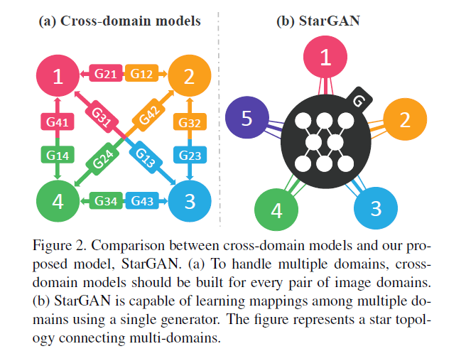
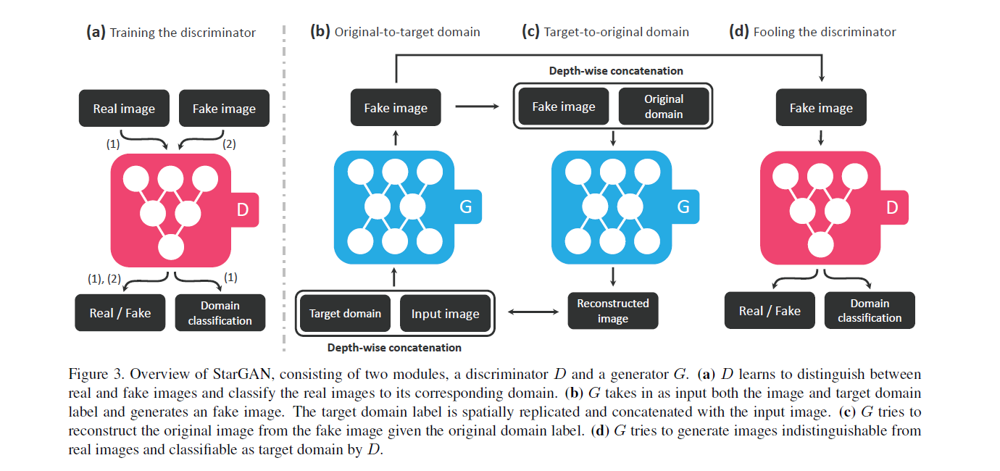
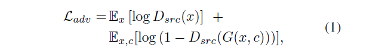
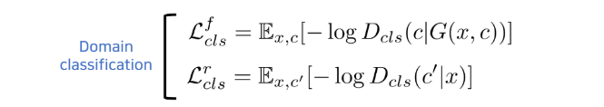
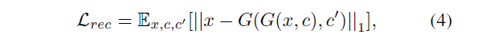
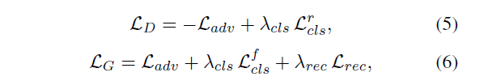
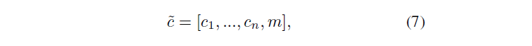
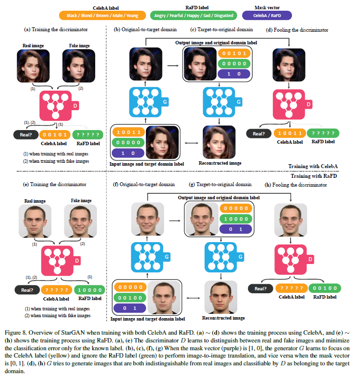

# StarGAN: Unified Generative Adversarial Networks for Multi-Domain Image-to-Image Translation

Paper) https://arxiv.org/abs/1711.09020 
Reference) StarGAN (꼼꼼한 딥러닝 논문 리뷰와 코드 실습) [[link]](https://www.youtube.com/watch?v=-r9M4Cj9o_8)

---

# Abstract

*However, existing approaches have limited scalability and robustness in handling more than two domains, since different models should be built independently for every pair of image domains.* 
2개의 domain 상에서 I2I translation에 대한 연구가 활발히 진행되고 있다. 그러나 기존 연구들은 한 쌍의 domain마다 각각의 독립적인 모델을 필요로 한다. 따라서 2개 이상의 domain을 다루는 task에서 scalability(확장성)과 robustnesss가 부족함을 지적하며 기존 모델들의 한계를 언급한다. 
 

*To address this limitation, we propose StarGAN, a novel and scalable approach that can perform image-to-image translations for multiple domains using only a single model.* 
StarGAN은 다수의 domain을 가진 task에서 오직 하나의 모델을 사용하여 I2I translation을 수행한다. 이는 기존 방법들의 한계를 돌파했다고 볼 수 있다. 
 

# 1. Introduction

*`Question) 논문에서 제시된 두 dataset은 각각을 domain이라고 할 수 있는가?`* 
*However, existing models are both inefficient and ineffective in such multi-domain image translation tasks. Their inefficiency results from the fact that in order to learn all mappings among k domains, k(k-1) generators have to be trained.* 
기존 모델은 multi-domain-image-to-image translation을 수행함에 있어서 비효율적이다. 위 이미지의 (a)에서 그 이유를 설명한다. 만약 4개의 domain을 가진 task를 수행하고자 한다면, 2개의 domain I2I translation을 담당하는 Generator 모델을 총 12개 만들어야 한다. 즉, k개의 domain이 존재하는 task는 총 k(k-1)개의 Generator가 각각 학습되어야 한다는 것을 의미한다. 
 

*Meanwhile, they are ineffective that even though there exist global features that can be learned from images of all domains such as face shapes, each generator cannot fully utilize the entire training data and only can learn from two domains out of k.* 
또한 기존 모델에서 각각의 G는 총 k개의 domain 데이터에서 2개의 domain과 관련된 데이터만을 학습하기 때문에 데이터 사용의 측면에서도 비효율적이라고 할 수 있다. 이는 곧 생성된 이미지의 품질적인 측면에서 한계가 있음을 짐작할 수 있다. 
 

*As demonstrated in Fig. 2 (b), our model takes in training data of multiple domains, and learns the mappings between all available domains using only a single generator.* 
기존 모델과는 달리 StarGAN은 위 이미지의 (b)와 같은 형태이다. 오직 하나의 G만 사용하여 multiple domain dataset을 학습하고, domain간에 mappling할 수 있는 모든 가능한 경우에 대하여 학습한다. 
 

*The idea is simple. Instead of learning a fixed translation (e.g., black-to-blond hair), our generator takes in as inputs both image and domain information, and learns to flexibly translate the image into the corresponding domain. We use a label (e.g., binary or one-hot vector) to represent domain information. During training, we randomly generate a target domain label and train the model to flexibly translate an input image into the target domain. By doing so, we can control the domain label and translate the image into any desired domain at testing phase.* 
 
StarGAN은 이미지와 domain 정보를 모두 input으로 받고, 유연하게 이미지를 변환하는 방법을 학습한다. 특히 어떤 domain인지에 대한 정보를 남기기 위해 label(binary or one-hot vector)을 사용한다.  훈련 중에는, 랜덤하게 target domain label을 생성하여 모델이 이에 대응하는 이미지로 유연하게 tranlation할 수 있도록 학습한다. 이러한 학습을 거치면 원하는 domain에 대한 이미지를 생성할 수 있게 된다. 
 

*We also introduce a simple but effective approach that enables joint training between domains of different datasets by adding a mask vector to the domain label. Our proposed method ensures that the model can ignore unknown labels and focus on the label provided by a particular dataset.* *Quesetion) 정확한 의미?* 
또한 StarGAN에서 사용하는 다른 접근을 하나 소개한다. domain label에 'mask vector'를 추가함으로써 다른 데이터의 domain을 연결시켜준다. 이는 모델이 특정 domain의 task만을 수행할 수 있도록 초점을 맞춰 준다.

## Summary

* *We propose StarGAN, a novel generative adversarial network that learns the mappings among multiple domains using only a single generator and a discriminator, training effectively from images of all domains.*
* *We demonstrate how we can successfully learn multi-domain image translation between multiple datasets by utilizing a mask vector method that enables StarGAN to control all available domain labels.*
* *We provide both qualitative and quantitative results on facial attribute transfer and facial expression synthesis tasks using StarGAN, showing its superiority over baseline models.*

# 2. Related Work

(...skip...)

# 3. Star Generative Adversarial Networks

## 3.1. Multi-Domain Image-to-Image Translation

### Adversarial Loss

*To make the generated images indistinguishable from real images, we adopt an adversarial loss where G generates an image G(x, c) conditioned on both the input image x and the target domain label c, while D tries to distinguish between real and fake images.* 
StarGAN의 loss function은 크게 3가지로 분류할 수 있다. 'Adversarial Loss', 'Domain Classification Loss', 'Reconstruction Loss'가 그것이다. 이 중 Adversarial Loss는 기존 GAN의 loss function과 유사하다. 차이라고 한다면, StarGAN의 G는 생성하고자 하는 조건(target domain label) c에 알맞는 이미지를 생성한다. G는 위의 식을 최소화하는 방향으로, D는 최대화하는 방향으로 학습한다. 
 

### Domain Classification Loss

*For a given input image x and a target domain label c, our goal is to translate x into an output image y, which is properly classified to the target domain c. To achieve this condition, we add an auxiliary classifier on top of D and impose the domain classification loss when optimizing both D and G.* 
StarGAN의 학습 목표는 x로부터 target domain c에 적합한 y를 생성해내는 것이다. 이를 위해 D와 G를 최적화하는 과정에서 각각의 domain classification term을  추가한다. 
 

*`Question) G를 학습하는 과정에서, 만약 D가 G(x,c)를 fake라고 분류하면 c에 대한 학습을 할 수 없는 것 아닌가?`* 
따라서 위의 두 term을 정의하고 각각 G와 D의 loss function에 추가시킨다. 이를 통해 G는 target domain c로 분류될 수 있는 이미지를 생성하는 방향으로 학습되고, D는 real이라고 판별한 이미지의 original domain c'을 잘 분류할 수 있는 방향으로 학습된다. 
 

### Reconstruction Loss

*`Question) 이 방법이 input image의 컨텐츠를 보존할 수 있다는 것이랑 무슨 관련이 있는지?`* 
*However, minimizing the losses (Eqs. (1) and (3)) does not guarantee that translated images preserve the content of its input images while changing only the domain-related part of the inputs. To alleviate this problem, we apply a cycle consistency loss [9, 33] to the generator,* 
위의 두 loss function만으로는 translated image가 input image의 컨텐츠를 보존한다는 것을 보장하지 않는다는 지적을 한다. 이에 따라 G에 cycle consistency loss를 적용하여 문제를 해결한다. 위의 식에서 G(x, c)는 original domain c'에서 target domain c로 변환하는 term이다. G(G(x, c), c')은 변환된 target domain c에서 다시 original domain c'으로 변환하는 term이다. 즉, 기존의 이미지 x와 변환을 두 번 반복한 이미지 G(G(x, c), c')의 L1을 loss function으로 설정함으로써, input image의 컨텐츠를 보존할 수 있다. 
 

### Full Objective

## 3.2. Training with Multiple Datasets

*An issue when learning from multiple datasets, however, is that the label information is only partially known to each dataset.* 
multiple dataset을 학습할 때의 문제는 label 정보가 dataset마다 다르기 때문에 '부분적으로' 존재한다. 이는 translated image G(x, c)로부터 input image x로 reconstruction하려면 label vector c'에 완전한 정보가 있어야 하기 때문에 문제가 된다. 

*Question solved - have to check) 이를 이해하려면 '학습'의 측면에서 생각해보는 것이 좋다. translated image에서 reconstruction한 image G(G(x, c), c')를 만든다고 해보자. 이 때 reconstruction하기 위해서는 c'에 대한 정보가 있어야 가능하다. 그런데 학습 데이터는 각 domain별로 각자의 label이 존재한다. 따라서 데이터의 종류를 파악하여 해당 데이터의 label로만 c'을 구성하기 위해 mask vector가 필요하다. 참고로 이렇게 reconstruction을 하는 이유는 reconstruction loss를 구하기 위함이다.*  

### Mask Vector

*To alleviate this problem, we introduce a mask vector m that allows StarGAN to ignore unspecified labels and focus on the explicitly known label provided by a particular dataset. In StarGAN, we use an n-dimensional one-hot vector to represent m, with n being the number of datasets. In addition, we define a unified version of the label as a vector,* 
위의 문제를 해결하기 위해 StarGAN은 mask vector 개념을 도입한다. StarGAN은 mask vector의 정보를 통해 연관되어 있지 않은 label을 무시하고, 특정 dataset에서 제공되는 명시적인 label에만 포커싱할 수 있다. mask vector인 m은 n차원의 one-hot vector이며, 여기서 n은 데이터셋 뭉치의 갯수를 의미한다. 이를 이용하여 위와 식과 같은 방법으로 label vector를 정의한다. [.]은 concatenation을 따르며, ci는 i번째 dataset의 label vector를 의미한다. 만약 어떤 이미지가 i번째 dataset에 해당한다고 가정하자. ci는 dataset이 binary attribute라면 binary vector로 표현되고, categorical attribute라면 one-hot vector로 표현된다. ci를 제외한 나머지 n-1개의 unknow label들은 단순히 0으로 할당시켜준다. 논문에서는 CelebA와 RaFD dataset을 사용하므로 n은 2가 된다. 
 

# 4. Implementation

## Improved GAN Training

*To stabilize the training process and generate higher quality images, we replace Eq. (1) with Wasserstein GAN objective with gradient penalty [1, 4] defined as,* 
실제로 학습을 수행할 때에는 고품질의 이미지를 얻기 위해 adversarial loss 부분을 바꿔준다. gradient penalty 기법을 적용한 Wasserstein GAN objective를 사용한다. 이에 대한 자세한 내용은 해당 논문을 찾아봐야 할 것이다. 
 

# 5. Experiments

*We perform one generator update after five discriminator updates as in [4].* 
GAN을 다루었을때의 내용처럼 1 epoch당 (D 학습 여러 번 + G 학습 1번) 으로 실험을 구성한 것을 확인할 수 있다. 
 

(...skip...)

# 6. Conclusion

(...skip...)

# 7. Appendix

## 7.1. Training with Multiple Datasets

*Fig. 8 shows an overview of StarGAN when learning from both the CelebA and RaFD datasets. As can be seen at the top of the figure, the label for CelebA contains binary attributes (Black, Blond, Brown, Male, and Young), while the label for RaFD provides information on categorical attributes (Angry, Fearful, Happy, Sad, and Disgusted). The mask vector is a two-dimensional one-hot vector which indicates whether the CelebA or RaFD label is valid.* 
논문에서는 마지막 단락에서 CelebA와 RaFD dataset으로 학습하는 StarGAN의 overview를 보여주면서 독자의 이해를 돕는다. CelebA는 binary attributes를 가지고 있는 반면, RaFD는 categorical attributes를 가지고 있다. 또한 2차원의 one-hot vector인 mask vector를 확인할 수 있다. 
 

*`Question) mask vector를 이용하여 특정 domain에서 control을 해주는 것을 확인했다. 그렇다면 두 domain을 동시에 설정하여 생성할 수는 없는가? ex) (CelebA의 Black + Brown + Male)과 (RaFD의 Happy)에 해당하는 이미지 생성`*