# Batch Normalization

Batch Normalization: Accelerating Deep Network Training by Reducing Internal Covariate Shift (PMLR 2015)<br>
How Does Batch Normalization Help Optimization? (NIPS 2018)

---

# 1. 배치 정규화(Batch Normalization) [꼼꼼한 딥러닝 논문 리뷰와 코드 실습]

Reference) [[link]](https://www.youtube.com/watch?v=58fuWVu5DVU)

## 1. 배치 정규화의 잘 알려진 장점

* 학습 속도(training speed)를 빠르게 할 수 있습니다.
* 가중치 초기화(weight initialization)에 대한 민감도를 감소시킵니다.
* 모델의 일반화(regularization) 효과가 있습니다.


## 2. 관련 연구

* 입력 정규화(Normalization): 각 차원의 데이터가 동일한 범위 내의 값을 가지도록 만들어 주는 것
  * 모든 특성(feature)에 대하여 각각 평균만큼 빼고 특정 범위의 값을 갖도록 조절할 수 있습니다.
* 입력 표준화(Standardization): 각 차원의 데이터가 N(0, 1) 분포를 따르도록 만들어주는 것

```python
import numpy as np
import matplotlib.pyplot as plt

x1 = np.asarray([32, 72, 40, 104, 52, 56, 89, 24, 52, 73])
x2 = np.asarray([9, 8, 7, 10, 5, 8, 7, 9, 8, 7])

normalized_x1 = (x1 - np.mean(x1)) / np.std(x1)		# standardization
normalized_x2 = (x2 - np.mean(x2)) / np.std(x2)		# standardization

plt.axvline(x=0, color='gray')
plt.axhline(y=0, color='gray')
plt.scatter(normalized_x1, normalized_x2, color='black')
plt.show()
```

* 화이트닝(Whitening): 평균이 0이며 공분산이 단위행렬인 정규분포 형태의 데이터로 변환하는 기법
  * 일반적으로 PCA나 화이트닝보다는 정규화가 더 많이 사용됩니다.

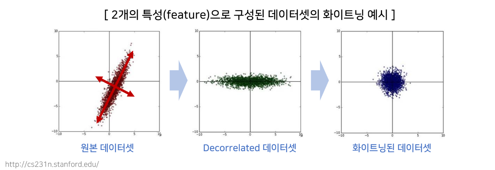


## 3. 배치 정규화(Batch Normalization)

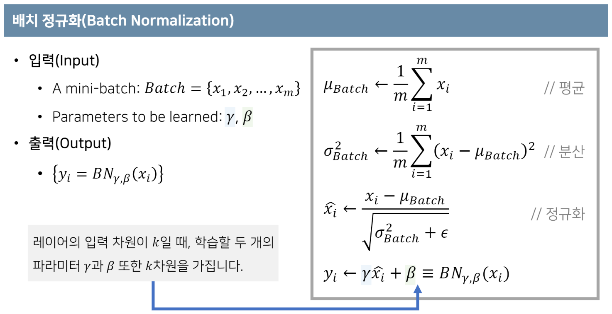

* MLP의 경우, gamm와 beta는 input 차원의 수(feature의 수)만큼 존재한다.
* CNN의 경우, gamma와 beta는 channel의 수만큼 존재한다.
* 일반적으로 BN -> Activation이지만, 이 둘의 순서에 대하여 명확한 답은 없다.
* 일종의 Whitening Transformation 역할 수행
* gamma: scailing
* beta: shifting


## 4. gamm와 beta를 사용하는 이유

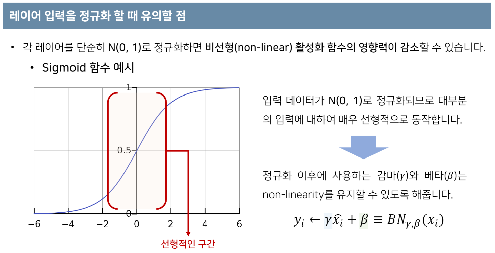


## 5. 데이터 플로우 그래프 & 

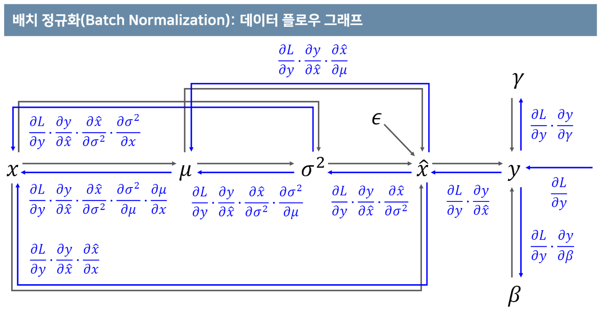

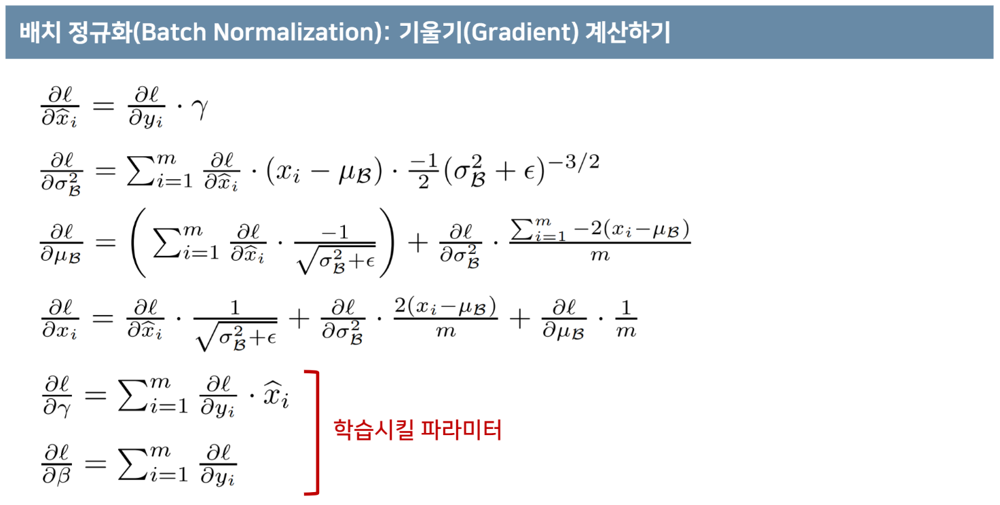


## 6. 학습(Training) 및 추론(Inference)

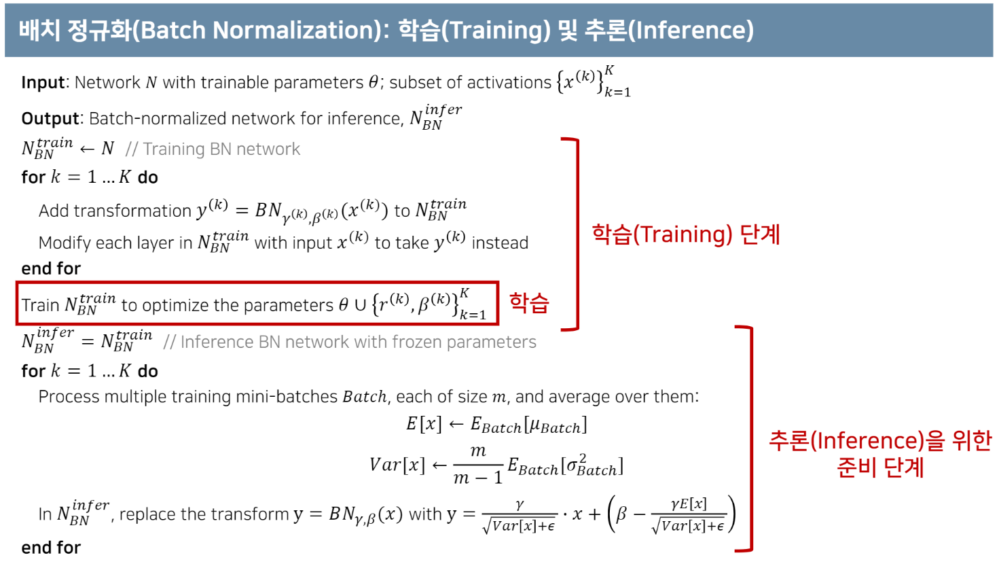

* k: activation의 개수
* Inference시, 이동 평균을 이용하여 training mini-batch들의 E[x]와 Var[x]를 구하여 사용한다.


## 7. 공변량 변화(Covariate Shift)

* 학습 시기와는 다르게 테스트 시기에 입력 데이터의 분포가 변경되는 현상


## 8. 내부 공변량 변화(Internal Covariate Shift, ICS)

* 공변량 변화(Covariate Shift)가 네트워크 내부에서 발생하는 현상
* 배치 정규화(batch normalization) 초창기 논문에서 해결하고자 했던 문제 상황

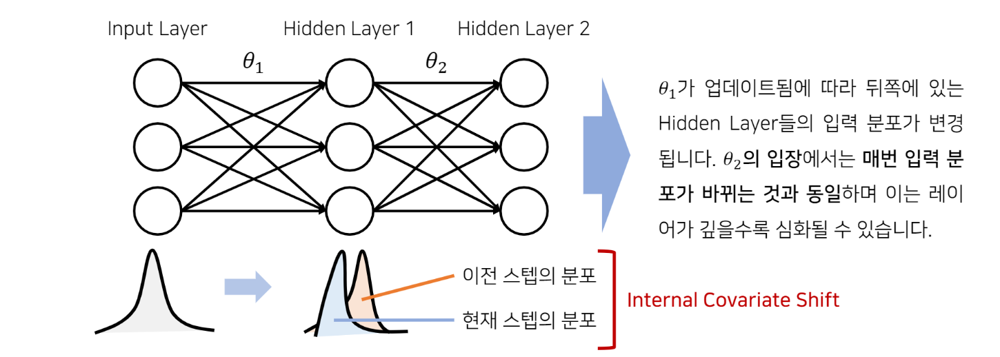


## 9. 배치 정규화와 ICS와의 관계

* 정말 배치 정규화의 성능 향상은 ICS의 감소로부터 기인한 것일까요?
  * 후속 연구에 의하면 배치 정규화의 효과와 ICS의 감소는 큰 상관이 없다는 주장이 제기됩니다.

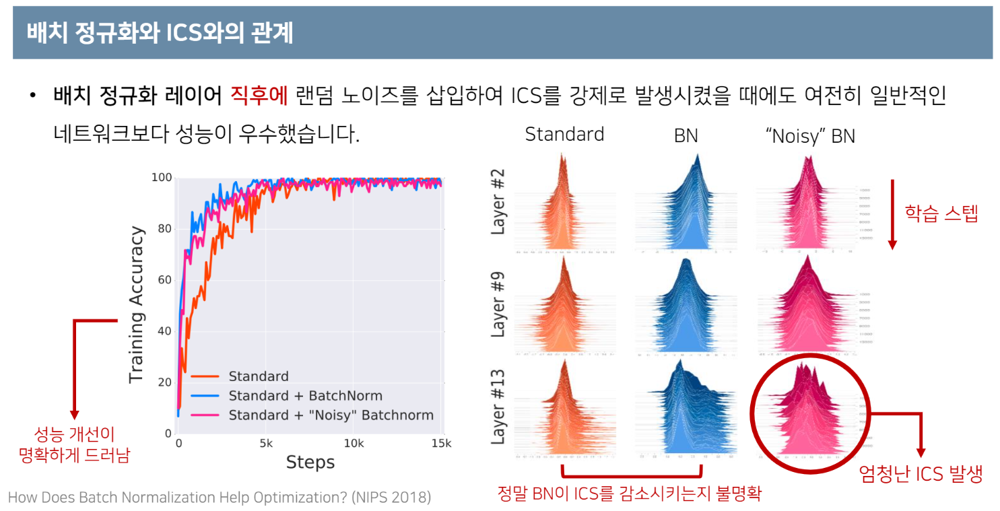


## 10. 배치 정규화가 잘 동작하는 이유 분석

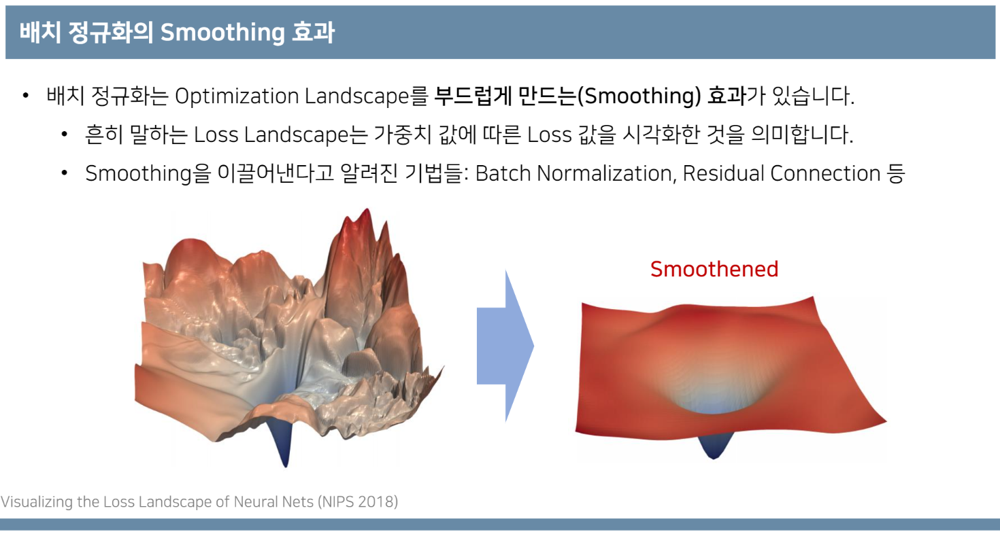

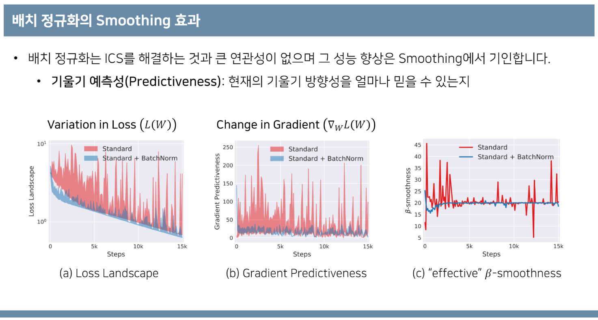

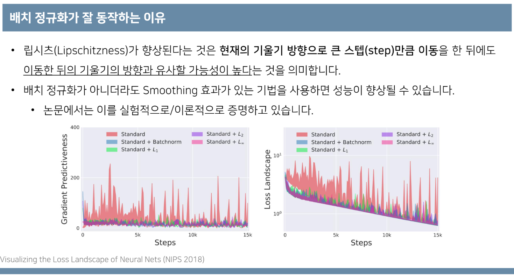


## 11. 립시츠 연속 함수(Lipschitz-Continuous Function)

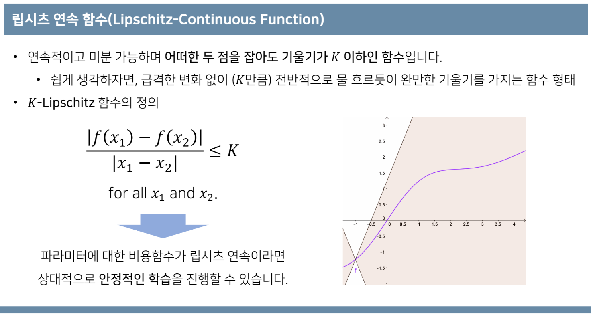