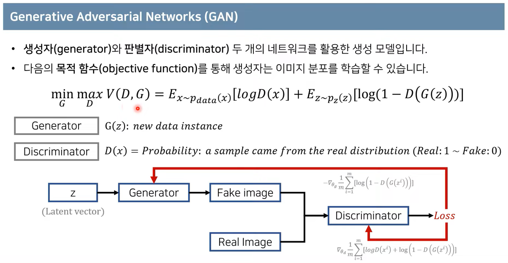
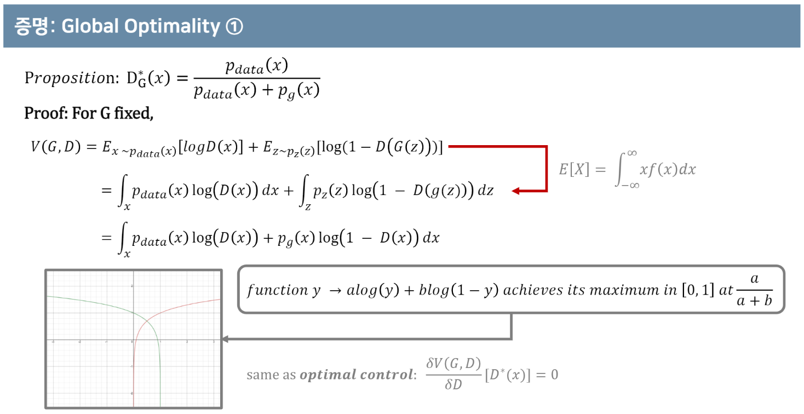

# GAN survey

---

# 1. GAN: Generative Adversarial Networks (꼼꼼한 딥러닝 논문 리뷰와 코드 실습)

Reference) [[link]](https://www.youtube.com/watch?v=AVvlDmhHgC4)

## 1. 이미지 데이터에 대한 확률 분포

* 확률분포: 확률 변수가 특정한 값을 가질 확률을 나타내는 함수
  * 이산확률분포: 확률변수 X의 개수를 정확히 셀 수 있을 때 ex) 주사위 눈금
  * 연속확률분포: 확률변수 X의 개수를 정확히 셀 수 없을 때(확률 밀도 함수를 이용해 분포를 표현) ex) 키, 달리기 성적
* 이미지 데이터는 다차원 특징 공간의 한 점으로 표현된다.
  * 이미지의 분포를 근사하는 모델을 학습할 수 있다.
  * 예를 들어 사람의 얼굴에는 통계적인 평균치가 존재하는데, 모델은 이를 수치적으로 표현할 수 있게 된다.
* 즉, 이미지 데이터에 대한 확률 분포는 이미지에서의 다양한 특징들이 각각의 확률 변수가 되는 분포(다변수 확률 분포, multivariate probability distribution)를 의미한다.

## 2. 생성 모델(Generative Models)

* 실존하지 않지만 있을 법한 이미지(+ 자연어, 오디오 등 모든 데이터 포함)를 생성할 수 있는 모델

* A statistical model of the joint probability distribution
* An architecture to generate new data instances

### 생성 모델의 목표

* 이미지 데이터의 분포를 근사하는 모델 G를 만드는 것
* 모델 G가 잘 동작한다는 의미는 원래 이미지들의 분포를 잘 모델링할 수 있다는 것을 의미
* 모델 G는 원래 데이터(이미지)의 분포를 근사할 수 있도록 학습

## 3. GAN

* GAN(G + D)을 학습하여 궁극적으로 사용하고자 하는 모델은 G이며, D는 G가 잘 학습할 수 있도록 도와주는 역할을 한다.
* x~pdata(x): 원본 데이터의 분포에서 하나의 데이터 x를 샘플링
* z~pz(z): 노이즈 데이터의 분포에서 하나의 데이터 z를 샘플링
* E: 기댓값으로써, 프로그램상에서는 단순히 모든 데이터를 하나씩 확인하여 식에 대입한 뒤에 평균을 계산
* V(D, G)에 대하여 G는 이 값을 minimize하려고 하고, D는 maximize하려고 한다. 이러한 목표를 봤을 때 G와 D 각각은 V(D, G)를 어떤 방향으로 이끌어가는지 생각하는 것이 중요하다.
* D 관점에서 봤을 때, logD(x)를 maximize하려고 하므로 D(x)는 1에 가까운 값을 얻으려고 할 것이다. 또한 log(1-D(G(z)))를 maximize하려고 하므로 1-D(G(z))는 1에 가까운 값 즉, D(G(z))는 0에 가까운 값을 얻으려고 할 것이다. 이를 해석하자면 D는 x를 실제(Real)라고 잘 분류하고, G(z)(G가 z를 통해 만든 가짜 데이터)를 가짜(Fake)라고 잘 분류하도록 학습이 된다.
* G 관점에서 봤을 때, log(1-D(G(z)))를 minimize하려고 하므로 1-D(G(z))는 0에 가까운 값 즉, D(G(z))는 1에 가까운 값을 얻으려고 할 것이다. 이를 해석하자면 G는 z를 통해 생성한 데이터를 D가 실제(Real)라고 잘 분류하도록 학습이 된다. 즉, 가짜 데이터셋을 잘 만들도록 학습이 된다.

* Pg --> Pdata: 생성자의 분포가 원본 학습 데이터의 분포와 유사해지도록 학습
* D(G(z)) --> 1/2: z를 통해 만든 G의 데이터가 D에 의해서 구분되지 못하도록 학습(즉 구분할 확률이 1/2이 되도록)
* 모델이 학습되고 나면, original data는 실제 분포의 특정 point들만 가지고 있는 반면 new data는 학습된 분포(실제 분포와 유사한 분포)의 모든 구간에서 point를 추출하여 약간의 노이즈를 넣는 방식으로 데이터를 생성할 수 있다.

## 4. GAN의 수렴 과정(증명)

# 2. PR12: GANs (by Jaejun Yoo)

Reference) [[link]](https://www.youtube.com/watch?v=kLDuxRtxGD8)

# 3. CS231N: Lecture 13. Generative Models

Reference) [[link]](https://www.youtube.com/watch?v=5WoItGTWV54&list=PL3FW7Lu3i5JvHM8ljYj-zLfQRF3EO8sYv&index=13)