# Generative Adversarial Networks survey


---


# 1. GAN: Generative Adversarial Networks (꼼꼼한 딥러닝 논문 리뷰와 코드 실습)

Reference) [[link]](https://www.youtube.com/watch?v=AVvlDmhHgC4)

## 1. 이미지 데이터에 대한 확률 분포

* 확률분포: 확률 변수가 특정한 값을 가질 확률을 나타내는 함수
  * 이산확률분포: 확률변수 X의 개수를 정확히 셀 수 있을 때 ex) 주사위 눈금
  * 연속확률분포: 확률변수 X의 개수를 정확히 셀 수 없을 때(확률 밀도 함수를 이용해 분포를 표현) ex) 키, 달리기 성적
* 이미지 데이터는 다차원 특징 공간의 한 점으로 표현된다.
  * 이미지의 분포를 근사하는 모델을 학습할 수 있다.
  * 예를 들어 사람의 얼굴에는 통계적인 평균치가 존재하는데, 모델은 이를 수치적으로 표현할 수 있게 된다.
* 즉, 이미지 데이터에 대한 확률 분포는 이미지에서의 다양한 특징들이 각각의 확률 변수가 되는 분포(다변수 확률 분포, multivariate probability distribution)를 의미한다.


## 2. 생성 모델(Generative Models)

* 실존하지 않지만 있을 법한 이미지(+ 자연어, 오디오 등 모든 데이터 포함)를 생성할 수 있는 모델

* A statistical model of the joint probability distribution
* An architecture to generate new data instances


### 생성 모델의 목표

* 이미지 데이터의 분포를 근사하는 모델 G를 만드는 것
* 모델 G가 잘 동작한다는 의미는 원래 이미지들의 분포를 잘 모델링할 수 있다는 것을 의미
* 모델 G는 원래 데이터(이미지)의 분포를 근사할 수 있도록 학습


## 3. GAN

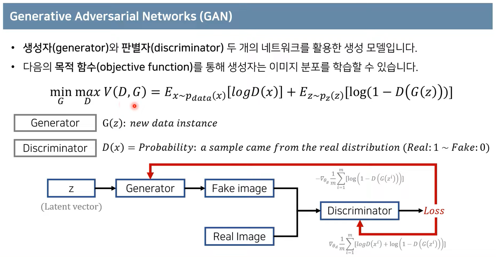

* GAN(G + D)을 학습하여 궁극적으로 사용하고자 하는 모델은 G이며, D는 G가 잘 학습할 수 있도록 도와주는 역할을 한다.
* x~pdata(x): 원본 데이터의 분포에서 하나의 데이터 x를 샘플링
* z~pz(z): 노이즈 데이터의 분포에서 하나의 데이터 z를 샘플링
* E: 기댓값으로써, 프로그램상에서는 단순히 모든 데이터를 하나씩 확인하여 식에 대입한 뒤에 평균을 계산
* V(D, G)에 대하여 G는 이 값을 minimize하려고 하고, D는 maximize하려고 한다. 이러한 목표를 봤을 때 G와 D 각각은 V(D, G)를 어떤 방향으로 이끌어가는지 생각하는 것이 중요하다.
* D 관점에서 봤을 때, logD(x)를 maximize하려고 하므로 D(x)는 1에 가까운 값을 얻으려고 할 것이다. 또한 log(1-D(G(z)))를 maximize하려고 하므로 1-D(G(z))는 1에 가까운 값 즉, D(G(z))는 0에 가까운 값을 얻으려고 할 것이다. 이를 해석하자면 D는 x를 실제(Real)라고 잘 분류하고, G(z)(G가 z를 통해 만든 가짜 데이터)를 가짜(Fake)라고 잘 분류하도록 학습이 된다.
* G 관점에서 봤을 때, log(1-D(G(z)))를 minimize하려고 하므로 1-D(G(z))는 0에 가까운 값 즉, D(G(z))는 1에 가까운 값을 얻으려고 할 것이다. 이를 해석하자면 G는 z를 통해 생성한 데이터를 D가 실제(Real)라고 잘 분류하도록 학습이 된다. 즉, 가짜 데이터셋을 잘 만들도록 학습이 된다.


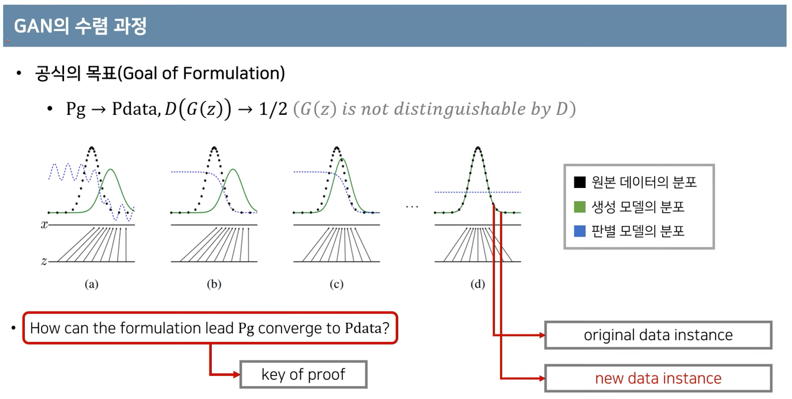

* Pg --> Pdata: 생성자의 분포가 원본 학습 데이터의 분포와 유사해지도록 학습
* D(G(z)) --> 1/2: z를 통해 만든 G의 데이터가 D에 의해서 구분되지 못하도록 학습(즉 구분할 확률이 1/2이 되도록)
* 모델이 학습되고 나면, original data는 실제 분포의 특정 point들만 가지고 있는 반면 new data는 학습된 분포(실제 분포와 유사한 분포)의 모든 구간에서 point를 추출하여 약간의 노이즈를 넣는 방식으로 데이터를 생성할 수 있다.


## 4. GAN의 수렴 과정(증명)

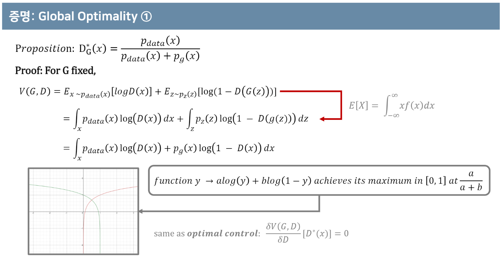

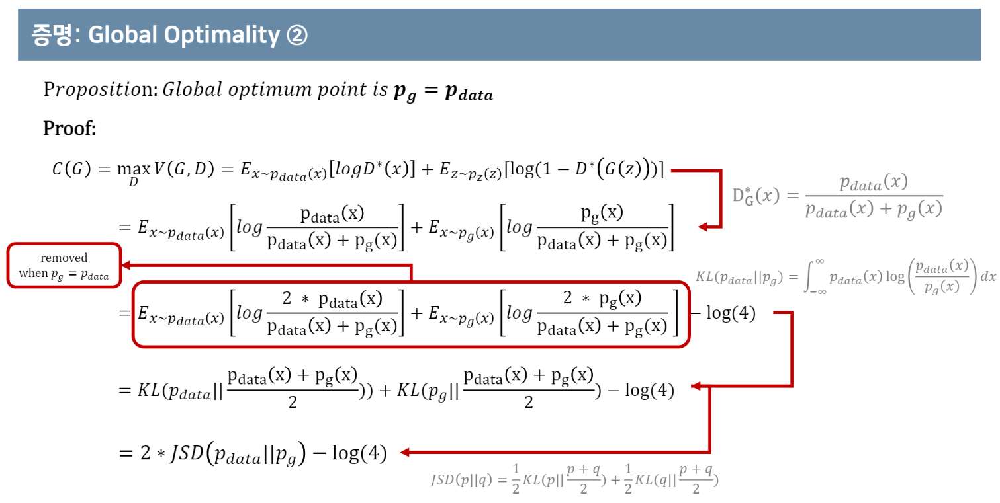

* KL(Kullback-Leibler divergence): KL(P||Q) --> P라는 distribution이 있을 때, (보통은 estimate한) Q가 P랑 얼마나 다른지 측정하는 값


# 2. PR12: GANs (by Jaejun Yoo)

Reference) [[link]](https://www.youtube.com/watch?v=kLDuxRtxGD8)<br>
Reference) 초짜 대학원생 입장에서 이해하는 Generative Adversarial Nets (1) [[link]](http://jaejunyoo.blogspot.com/2017/01/generative-adversarial-nets-1.html)<br>
Reference) 초짜 대학원생 입장에서 이해하는 Generative Adversarial Nets (2) [[link]](http://jaejunyoo.blogspot.com/2017/01/generative-adversarial-nets-2.html)

## 1. Prerequisties

* Unsupervised Learning
  * meaning: No label or curriculum
  * Boltzmann machine
  * Auto-encoder or Variation Inference
  * Generative Adversarial Network


## 2. Two Step Approach

Show that...

1. The minmax problem of GAN has a global optimum at pg = pdata
2. The proposed algorithm(alternative algorithm) can find that global optimum

위 두 가정은 수학적 전개를 통해 증명한다. 2번의 경우는 C(G) = 2 * JSD(pdata||pg) - log(4)의 형태가 convex인 것을 언급하면서 rough하게 설명한다. 참고로 JSD는 두 distribution의 distance를 의미하며, 항상 0 이상의 값을 가진다. 따라서 C(G)는 global minimum이 -log(4)인 convex function이라고 (rough하게) 말할 수 있다.


# 3. 1시간만에 GAN(Generative Adversarial Network) 완전 정복하기

Reference) [[link]](https://www.youtube.com/watch?v=odpjk7_tGY0)

## 1. Code

```python
# 의미상 코드

import torch
import torch.nn as nn

D = nn.Sequential(
	nn.Linear(784, 128),
	nn.ReLU(),
	nn.Linear(128, 1),
	nn.Sigmoid())
	
G = nn.Sequential(
	nn.Linear(100, 128),
	nn.ReLU(),
	nn.Linear(128, 784),
	nn.Tanh())
	
criterion = nn.BCELoss()

d_optimizer = torch.optim.Adam(D.parameters(), lr=0.01)
g_optimizer = torch.optim.Adam(G.parameters(), lr=0.01)

# Assume x be real images of shape (batch_size, 784)
# Assume z be random noise of shape (batch_size, 100)

while True:
	# train D
	loss = criterion(D(x), 1) + criterion(D(G(z)), 0)
	loss.backward()
	d_optimizer.step()
	
	# train G
	loss = criterion(D(G(z)), 1)
	loss.backward()
	g_optimizer.step()
```


## 2. Non-Saturating Game

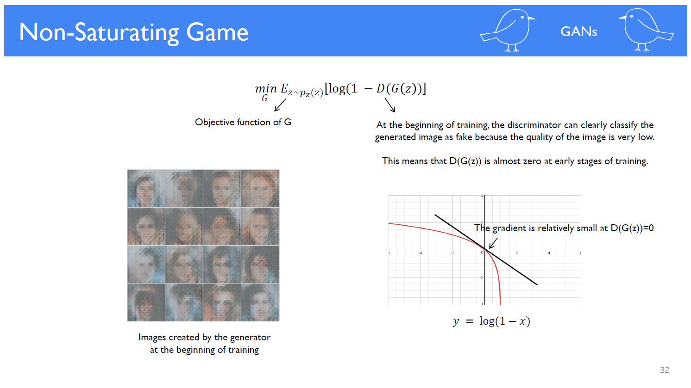

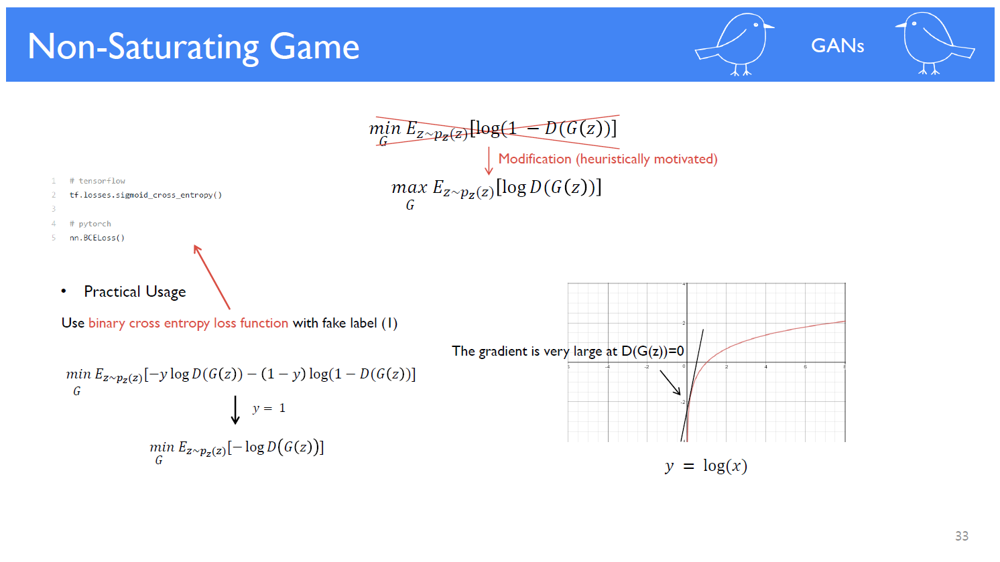

G를 학습할 때 log(1 - D(G(z)))를 최소화하는 방향이 아니라, log(D(G(z)))를 최대화하는 방향으로 loss function을 설정한다.<br>
학습 초기에는 G가 fake에 가까운 이미지를 output으로 출력하기 때문에 D가 이를 판별하기가 쉽다. 따라서 D(G(z))는 0에 수렴하고, 이 때의 gradient값은 굉장히 작다. 따라서 이러한 현상을 해결하기 위해 log(D(G(z)))를 최대화하는 방향으로 학습하면 굉장히 큰 값의 gradient를 얻을 수 있다. binary cross entropy 관점에서 두 loss fuction의 방향성은 같다는 것을 확인할 수 있다.


## 3. Deep Convolutional GAN(DCGAN), 2015

FC가 아닌 CNN을 통해 Discriminator를 구현하고, deconvolution(또는 transpose convolution)을 통해 Generator를 구현한 모델을 DCGAN이라고 한다. pooling layer를 사용하면 이미지가 깨지는 문제가 발생할 수 있기 때문에 이는 사용하지 않는다는 것이 특징이다.

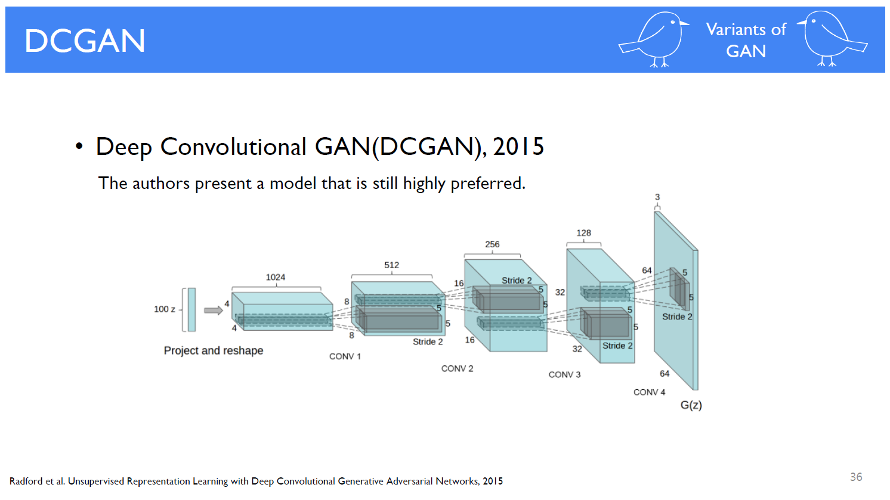

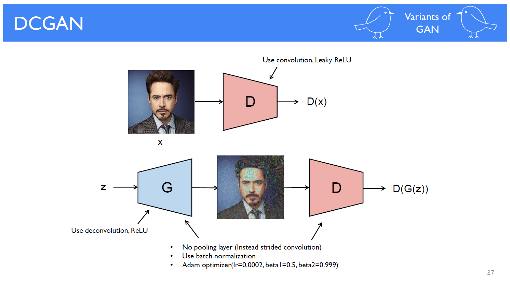


## 4. Least Squares GAN(LSGAN), 2016

```python
# 의미상 코드

D = nn.Sequential(
	nn.Linear(784, 128),
	nn.ReLU(),
	nn.Linear(128, 1))

G = nn.Sequential(
	nn.Linear(100, 128),
	nn.ReLU(),
	nn.Linear(128, 784),
	nn.Tanh())

# Loss of D
# D(x) gets closer to 1
# D(G(z)) gets closer to 0
# (same as original)
D_loss = torch.mean((D(x) - 1)**2) + torch.mean(D(G(z))**2)

# Loss of G
# D(G(z)) gets closer to 1
# (same as original)
G_loss = torch.mean((D(G(z)) - 1)**2)
```

*Question*<br>
기존 GAN의 loss function을 바꿈으로써, G에 의해서 생성된 이미지가 data distribution의 boundary 안으로 들어오게 하는 효과를 준다. 이를 통해 D를 속이더라도 기존 data와 유사한 이미지를 생성할 수 있다. *but 근거에 대한 이해가 부족하다.*


## 5. Semi-Supervised GAN(SGAN), 2016

SGAN에서 D는 단순히 real or fake만을 판별하는 것이 아니라, 클래스 자체를 판별한다. 여기서는 새로운 클래스(MNIST의 경우 11이라는 클래스)를 fake라고 정의한다. 따라서 D는 기존 데이터에 대해서 레이블링된 클래스를 예측하고, G가 생성한 데이터에 대해서 fake라는 클래스를 예측하는 것이 목적이다. 반면에 G는 latent vector와 레이블을 입력하여 데이터를 생성하면, D가 그것을 설정한 레이블로 예측하도록 하는 것이 목적이다. SGAN의 특징은 원하는 레이블을 가지고 있는 데이터를 생성할 수 있다는 점이다.

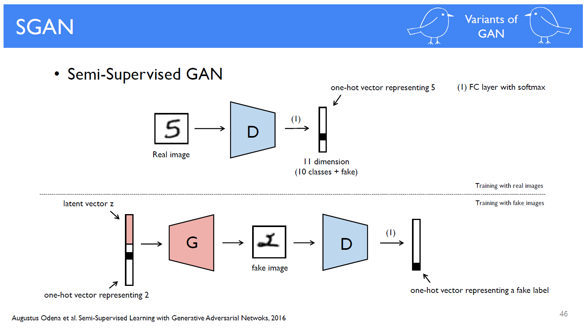


## 6. Auxiliary Classfier GAN(ACGAN), 2016

ACGAN은 SGAN에서 좀 더 발전된 형태이다. SGAN의 D는 real이라면 어떤 클래스인지를 예측하고, fake라면 fake 자체를 예측했다. 반면에 ACGAN의 D는 multi-task learning으로써, (1) real or fake인지를 예측하고(sigmoid function), (2) (fake라고 하더라도) 어떤 클래스인지를 예측한다(softmax function). 이를 통해 G에서 생성된 이미지일지라도 D는 fake image에 대한 class를 학습하는 효과를 얻을 수 있다. G가 학습할수록 더 real에 가까운 데이터를 생성하기 때문이다. 이는 augmentation과 같은 역할을 하여 모델을 좀 더 robust하게 만들 수 있게 해준다. 이전까지의 모델들과는 달리 D에 좀 더 집중을 하여 모델을 구성했다고 직관적으로 해석할 수 있다.

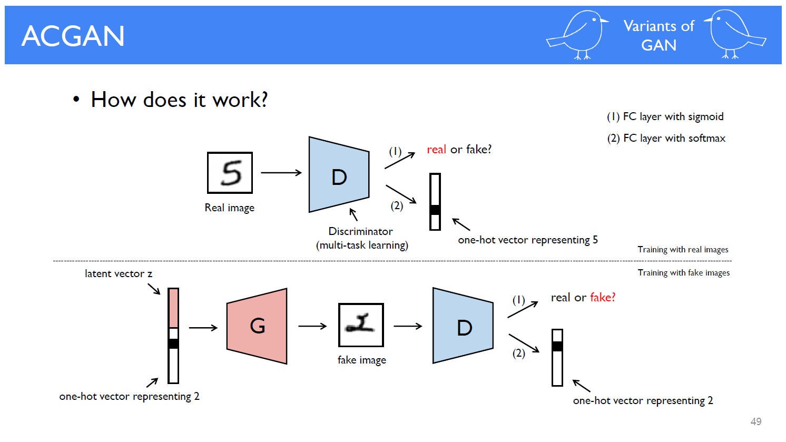

## 7. CycleGAN: Unpaired Image-to-Image Translation

(...skip...)

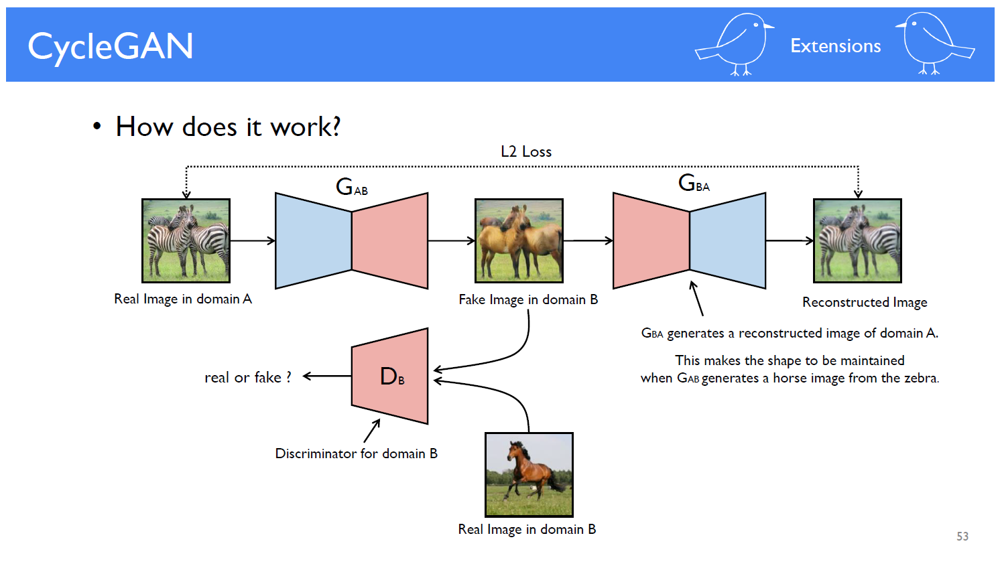


## 8. StackGAN: Text to Photo-realistic Image Synthesis

(...skip...)<br>
(아래 모델 구조는 StackGAN의 일부를 표현함)

