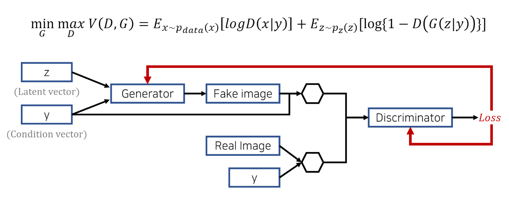
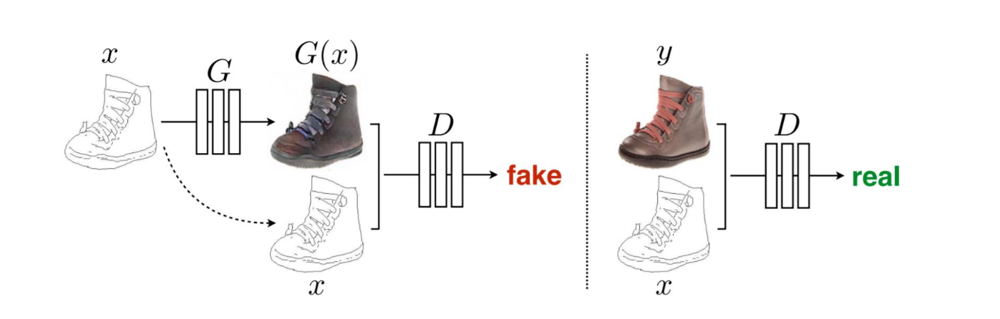
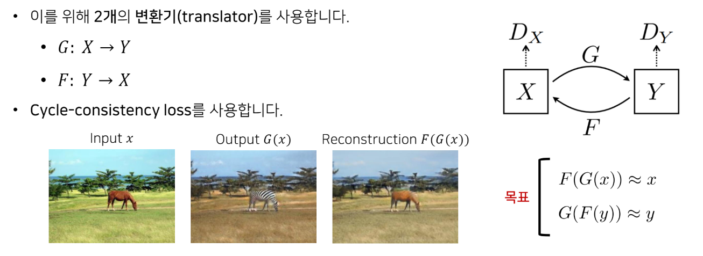
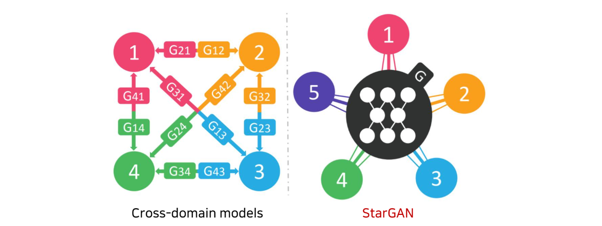
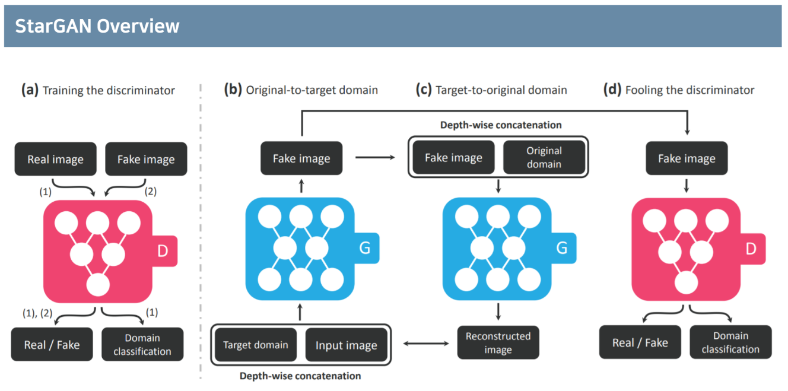
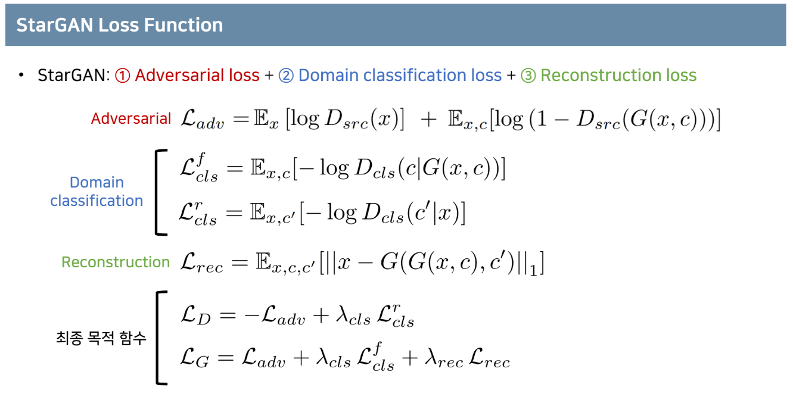
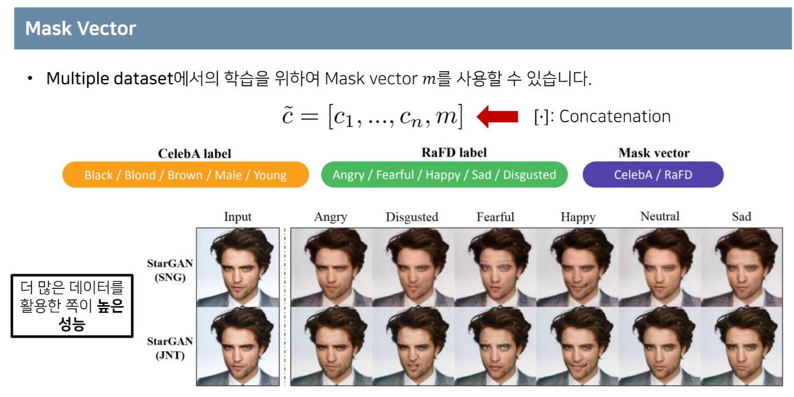
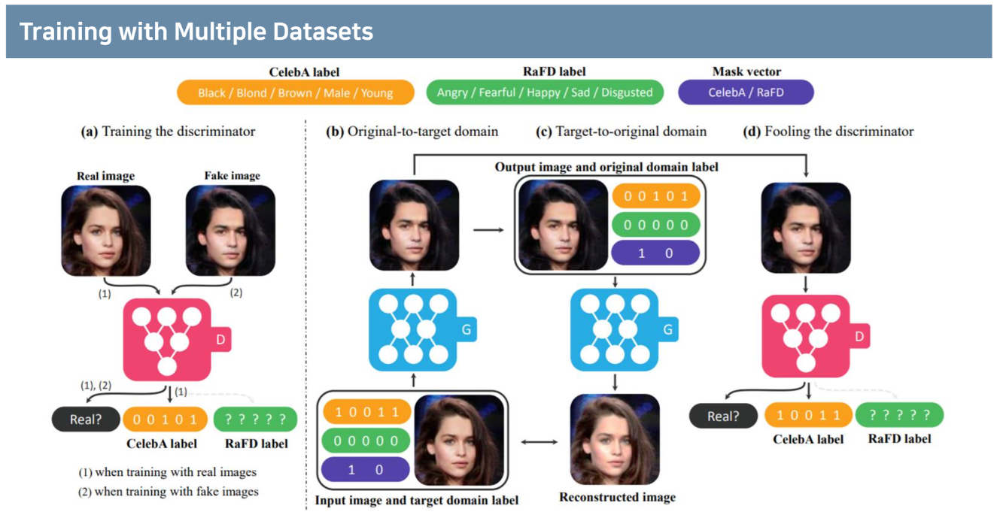
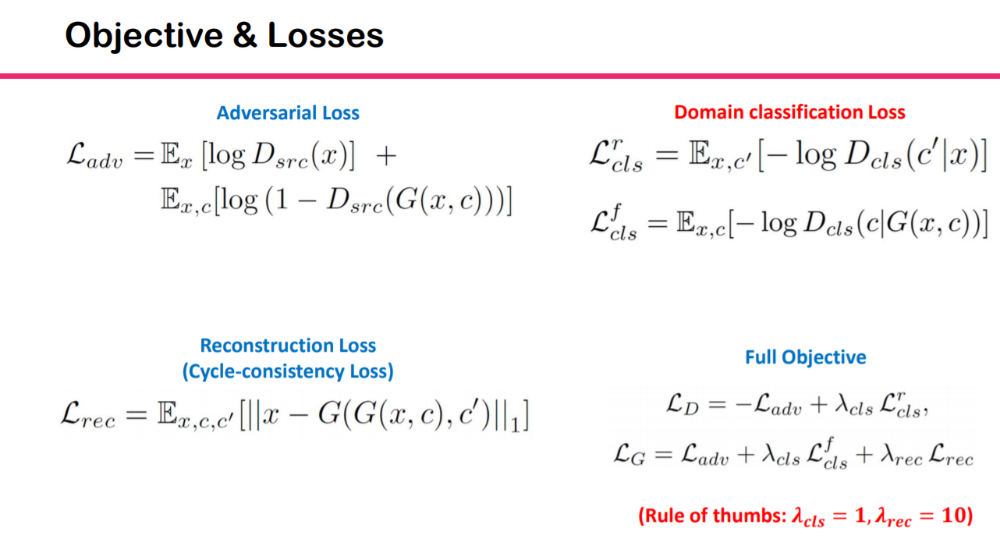

# StarGAN Survey

 StarGAN: Unified Generative Adversarial Networks for Multi-Domain Image-to-Image Translation (2018 CVPR)

---

# 1. StarGAN (꼼꼼한 딥러닝 논문 리뷰와 코드 실습)

Reference) [[link]](https://www.youtube.com/watch?v=-r9M4Cj9o_8)

## 1. Abstract

본 논문은 딥러닝 분야 최우수 학회 중 하나인 CVPR 2018의 구두 발표 세션에서 발표된 논문으로, **1) 단일 네트워크를 이용해 2) 다중 도메인 상에서의 image-to-image translation**을 가능하도록 해주는 StarGAN을 제안합니다.

## 2. 연구 배경: Conditional GAN(cGAN)

* 데이터의 모드(mode)를 제어할 수 있도록 조건(condition) 정보를 함께 입력하는 모델입니다.
* condition vector를 입력한다는 점에서 'SGAN'과 유사하다. 다만 SGAN은 임의의 한 클래스를 추가하여 fake라고 정의한다.

## 3. 연구 배경: Image-to-Image Translation: Pix2pix

* The task of I2I(Image to Image) translation is to change a particular aspect of a given image to another.
* 대표적인 Image-to-Image translation 아키텍처로 pix2pix가 있습니다.
  * Pix2pix는 학습 과정에서 이미지를 조건(condition)으로 입력하는 cGAN의 유형으로 볼 수 있습니다.
* 더 이상 G의 input은 z(latent vector)가 아니라, 해결하고자 하는 문제의 domain(image 등) x이다.

* 한계점) Pix2pix는 서로 다른 두 도메인 X, Y의 데이터를 한 쌍으로 묶어 학습을 진행합니다.
  * 즉 X와 Y가 대응되는 구조의 paired dataset을 미리 구축해두어야 한다.
  * Colorization과 같은 태스크에서는 데이터셋을 구성하기 쉬우나(X: 스케치 그림, Y: 실제 사진) 그렇지 않은 경우(X: 풍경 사진, Y: 풍경화)도 존재합니다.
  * 따라서 한 쌍으로 묶이지 않은(Unpaired) 데이터 셋에 대하여 CycleGAN을 이용할 수 있다.

## 4. 연구 배경: Image-to-Image Translation: Cycle GAN

* CycleGAN은 G(x)가 다시 원본 이미지 x로 재구성(reconstruct)될 수 있는 형태로 만들어지도록 합니다.
  * 이를 통해 원본 이미지의 content(or identity)는 보존(preserve)하고 도메인과 관련한 특징을 바꿀 수 있습니다.
* F: Y domain에서 X domain으로 보내주는 역할을 하는 inverse mapping을 수행하는 function

## 5. 연구 배경: WGAN-GP

* GAN 분야에서의 SOTA
* weight clipping(1-Lipshichtz 조건을 만족하도록 하여 안정적인 학습 유도) + gradient penalty(성능 개선)
* GAN의 성능 평가 지표: Inception Score

(...skip...)

## 6. StarGAN: 다중 도메인을 위한 하나의 모델

* 하나의 뉴럴 네트워크를 이용해 다중 도메인(multi domain) 사이에서의 이미지 변환이 가능합니다.
  * 기존 image-to-image translation 아키텍처를 그대로 이용한다면 여러 개의 네트워크가 필요합니다.
* 다중 도메인임에도 불구하고 하나의 뉴럴 네트워크만 사용하므로, 모델의 파라미터 측면에서 공간 효율적이다.
* 다중 도메인의 데이터를 모두 학습에 사용할 수 있기 때문에 데이터의 공통적인 특징에 대하여 G가 더욱 잘 학습을 할 수 있다.

## 7. StarGAN Overview

### Concept: cGAN + Cycle-consistency loss + multi domain

(a) D는 real에 대해서 real이라고 예측하고 domain classification을 수행한다. 반면에 fake에 대해서 fake라고 예측하고 domain classification은 무시한다. 
(b) G는 input image와 만들고자 하는 target domain을 받아서 fake image를 생성한다. 
(c) G로부터 생성한 fake image와 original domain(input image의 domain)을 다시 G의 입력으로 넣어서 원본 이미지와 같은 형태인 reconstructed image를 생성한다. 이후 input image와 reconstructed image를 비교하는 loss function을 사용함으로써, G가 input image에 대하여 content(or identity)는 보존하고 도메인과 관련된 특징을 바꾸도록 학습한다. 
(d) G를 통해 나온 fake image에 대하여 D가 real이라고 출력할 수 있도록 학습한다.

## 8. Loss Function

Loss Function은 목적에 따라 3가지로 분해할 수 있다. 
1) Adversarial loss: 생성한 이미지가 실제 이미지와 유사하도록 해주는 함수, multi domain이므로 G를 생성할 때 c가 존재 
2) Domain Classification: G는 G(x, c)에 대하여 D가 c라고 예측하는 방향으로 학습한다. 반면에 D는 x에 대하여 c'(x의 domain)이라고 예측하는 방향으로 학습한다. 
3) Reconstruction: G(G(x, c), c')은 c의 domain으로 생성된 이미지를 다시 c'의 domain(x의 domain)으로 생성한 이미지를 의미한다. 즉 reconstruction 이미지와 기존 이미지 x와의 l1 loss가 작아지는 방향으로 학습한다.

* 참고로 D는 adversarial이 최대화하는 방향으로 학습하기 때문에 L(adv)에 음수를 붙였다. 반면에 G는 adversarial이 최소화하는 방향으로 학습하기 때문에 그대로 사용한다.
* 실제로 StarGAN은 위의 adversarial을 사용할 때 gradient penalty를 적용하여 사용한다.

## 9. Mask Vector

* m이 0 값을 갖는다면 CelebA label을 사용하고, 1 값을 갖는다면 RaFD label을 사용하도록 설정할 수 있음을 의미한다. 즉, 어떤 domain의 dataset을 사용할지를 결정하는 인자이다.
* 위의 SNG는 RaFD만 사용하여 학습했을 때를 의미하고, JNT는 CelebA와 RaFD를 모두 사용하여 학습했을 때를 의미한다. 데이터셋을 더 많이 사용할수록 성능이 좋아짐을 확인할 수 있다. 이는 Data Augmentation과 같은 효과라고 볼 수 있다.

## 10. StarGAN Overview

# 2. PR-152:StarGAN: Unified Generative Adversarial Networks for Multi-Domain Image-to-Image Translation

Reference) [[link]](https://www.youtube.com/watch?v=i3-rTEFpyv0)

## 1. CycleGAN vs StarGAN

* CycleGAN에 비하여 StarGAN이 가지고 있는 단점이 있다. StarGAN은 multi-domain dataset을 학습하기 때문에, 모든 dataset의 사이즈를 동일하게 맞춰주어야 한다. 반면에 CycleGAN은 학습하려는 두 domain의 dataset 사이즈만 동일하면 학습이 가능하다.

## 2. Objective Function

* Object Function에서 유념해서 봐야 할 부분이 있다. Domain Classification Loss와 Full Objective를 살펴보면, L(real)은 L(D)에만 사용되고 L(fake)는 L(G)에만 사용되는 것을 확인할 수 있다. 즉, L(real)은 D를 학습할 때에만 사용되고, L(fake)는 G를 학습할 때에만 사용된다. D를 학습하는데에 L(fake)를 사용하지 않는 이유는, 학습 초기에 G(x, c)가 랜덤/노이즈의 이미지를 내놓기 때문에 D의 성능 저하에 영향을 끼칠 수 있기 때문이라고 발표에서 언급한다.

* 논문의 저자는 Reconstruction Loss에 더 많은 가중치(lambda = 10)를 주어서 contents를 보호하는 방향으로 학습하는 것을 중요하게 생각했음을 확인할 수 있다.

## 3. Limiations

* Use the same size of the images for translation
  * Hard to extend on different size of the images in different datasets
* Claimed Multiple datasets but Provide the results on two datasets
  * Not sure on the scalability of multiple datasets