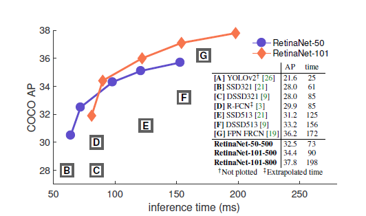
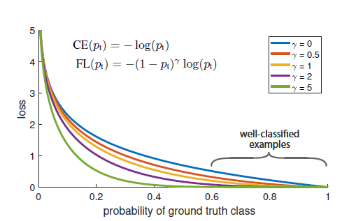
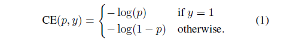
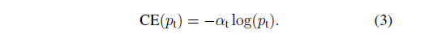
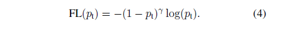
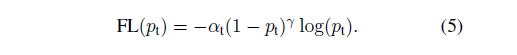

# Focal Loss for Dense Object Detection

paper(17.08) https://arxiv.org/abs/1708.02002
code None

---

# Abstract

**"We discover that the extreme foreground-background class imbalance encountered during training of dense detectors is the central cause."** 
Object Detection Model은 크게 1-stage 계열과 2-stage 계열로 구분할 수 있다. 흔히 2-stage 계열의 모델이 1-stage 계열의 모델보다 speed는 낮지만 accuracy가 높은 특징을 가지고 있다. 저자는 1-stage 계열의 모델의 accuracy가 상대적으로 낮은 이유를 class imbalance 문제 때문이라고 발견했다.

**"We propose to address this class imbalance by reshaping the standard cross entropy loss such that it down-weights the loss assigned to well-classified examples. Our novel Focal Loss focuses training on a spares set of hard examples and prevents the vast number of easy negatives from overwhelming the detector during training."** 
따라서 기존에 존재하던 cross entropy loss function을 수정하여 학습을 잘 하지 못하는 dataset에 가중치를 부여하도록 하는 loss function이 이 논문의 주제인 Focal Loss이다.

# 1. Introduction

**"The loss function is a dynamically scaled cross entropy loss, where the scaling factor decays to zero as confidence in the correct class increses, see Figure 1. Intuitively, this scaling factor can automatically down-weight the contribution of easy examples during training and rapidly focus the model on hard examples."** 
cross entropy loss를 개조한 focal loss는 쉬운 example에는 가중치를 낮추고 어려운 example에는 가중치를 높이는 방식으로 작동한다.

**"To demonstrate the effectieness of the proposed focal loss, we design a simple one-stage object detector called RetinaNet, named for its dense sampling of object locations in an input image."** 
특히 focal loss를 적용하기 위해 저자는 독자적인 모델인 RetinaNet을 디자인하여 적용한다. 이는 위의 그림에서도 확인할 수 있듯이, 기존 one-stage detection model과 two-stage detection 모델의 성능을 훨씬 뛰어넘는 결과를 얻을 수 있었다.

# 2. Related Work

### Classic Object Detectors

### Two-stage Detectors

**"We emphasize that our simple detector achieves top results not based on innovations in network design but due to our novel loss."** 
저자는 RetinaNet의 성능이 좋은 이유가 특별한 네트워크의 디자인 때문이 아니라 focal loss function 때문이라고 주장한다.

### Class Imbalance

**"This imbalance causes two problems:
(1) training is inefficient as most locations are easy negatives that contribute no useful learning signal
(2) en masse, the easy negatives can overwhelm training and lead to degenerate models"** 
class imbalance problem이 존재할 경우 위와 같이 두 가지 문제점을 야기한다고 주장한다. 핵심은 negative samples이 상대적으로 많기 때문에 학습의 주도권을 가져가서 모델이 비효율적으로 학습될 가능성이 높다는 것이다.

### Robust Estimation

**"In contrast, rather than addressing outliers, our focal loss is designed to address class imbalance by down-weighting inliers(easy examples) such that their contribution to the total loss is small even if theri number is large."** 
focal loss는 기존 huber loss와는 방식이 반대로 작동한다. huber loss는 outliers를 down-weighting 함으로써 이들의 영향력을 줄여준다면, focal loss는 inliers(easy examples)을 down-weighting함으로써 total loss를 작게 만들어준다. 이에 대한 이해가 부족하여 일단 건너뛰고 다음 내용으로 넘어갔다.

# 3. Focal Loss

위의 그림에서 파란색으로 표시한 부분이 Cross Entropy에 대한 그래프이다. 저자는 ground truth가 0.5 이상처럼 쉽게 분류할 수 있는 경우에 대해서도 loss값이 크다고 언급하고 있다. 또한 이러한 loss값이 합쳐지면 더욱 더 큰 loss 값이 도출될것이다.

### 3.1. Balanced Cross Entropy

class imbalance 문제를 해결하는 첫 번째 방법은 각 class에 가중치를 부여하는 것이다. class 빈도에 반비례하여 설정하거나 cross validation에 의해 하이퍼파라미터로써 설정하기도 한다.

### 3.2. Focal Loss Definition

**"Instead, we propose to reshape the loss function to down-weight easy examples and thus focus training on hard negatives.
More formally, we propose to add a modulating factor ${\left(1-{p}^{t} \right)}^{r}$ to the cross entropy loss, with tunable focusing parameter $\gamma \geq 0$."** 
focal loss는 기존 cross entropy에 가중치를 조절하는 변수를 추가한 형태로 디자인되어있다. 일반적으로  $\gamma$는 0과 5 사이의 값을 사용하며, 실험상으로는 값을 2로 주었을 때 가장 좋은 결과를 얻었다고 언급한다. $\gamma$를 2라고 가정해보자. 만약 잘 맞춘 example이 있다고 할 때, 해당 ${p}^{t}$는 0.9처럼 높은 값일 것이다. 대입해보면 0.01배만큼 가중치를 감소시켜 적용한다. 이는 반대로 다른 값들, 즉 잘 맞추지 못한 example의 가중치를 높여주는 효과가 있다. $\gamma$가 0이라면 기존 cross entropy와 같아지며, $\gamma$의 값이 커질수록 잘 맞춘 example의 영향력이 더 작아진다.

실제 실험에서는 위와 같은 형태처럼 또 하나의 변수를 추가한 형태의 focal loss가 약간 더 좋은 성능을 냈다고 말한다. 

### 3.3. Class Imbalance and Model Initialization

*discussion*
**"To counter this, we introduce the concept of a 'prior' for the value of p estimated by the model for the rare class (foreground) at the start of training"** 
해당 방법은 모델을 초기화하는 과정에서 사용하는데, 이를 통해 training 안정성을 증가시켜준다고 한다. 제대로 이해를 하지 못해 다시 한 번 볼 필요성이 있다.

### 3.4. Class Imbalance and Two-stage Detectors

# 4. RetinaNet Detector

ToDo~