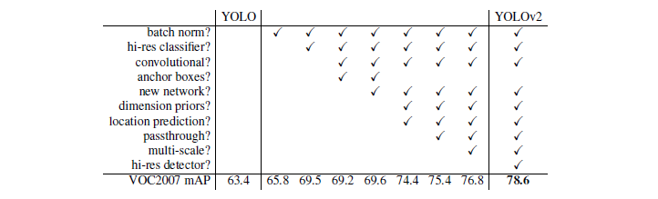
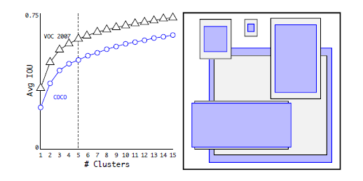
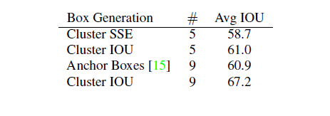
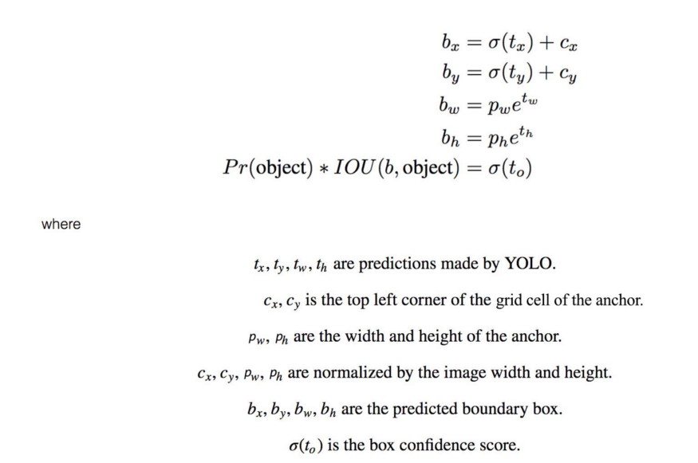
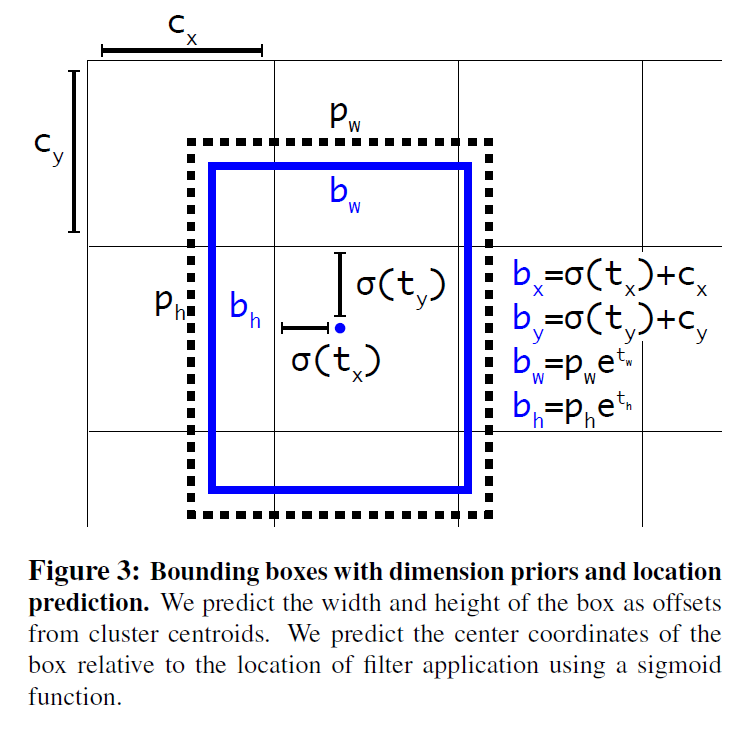
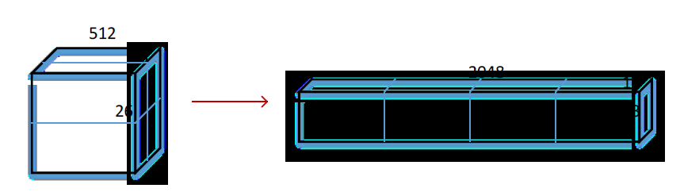
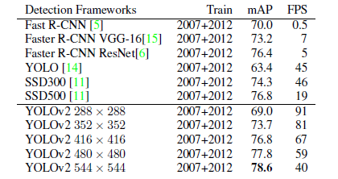
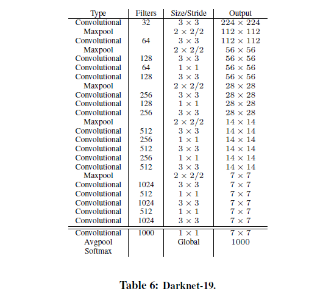

# YOLO9000: Better, Faster, Stronger

paper(16.12) https://arxiv.org/abs/1612.08242 
code https://pjreddie.com/darknet/yolov2/

---

# Abstract

**We introduce YOLO9000, a state-of-the-art, real-time object detection system that can detect over 9000 object categories.** 
YOLO의 두 번째 버전인 YOLO9000은 9000개의 클래스를 구분할 수 있다고 자신하기 때문에 이러한 이름을 붙였다.

**"Fisrt we propose various improvements to the YOLO detection method, both novel and drawn from prior work."** 
기존 YOLO 모델을 토대로 새로운 방법들을 제안한다. 적용한 Dataset마다 performace를 수치화함으로써 입증하고 있다.

**"Using a novel, multi-scale training method the same YOLOv2 model can run at varying sizes, offering an easy tradeoff between speed and accuracy."** 
YOLOv2(YOLO9000과 사실상 동일한 모델)는 multi-scale training method를 통해 다양한 사이즈의 크기를 학습하여 그 성능을 더 높였다.

**"Finally we propose a method to jointly train on object detection and classification"** 
해당 논문은 두 개의 dataset을 합쳐서 학습을 시키는 독특한 접근을 하는데, 나는 이에 대한 이해가 완벽하지는 않아서 간단히 살펴보고 넘어갈 예정이다.

# 1. Introduction

**"We propose a new method to harness the large amount of clasification data we already have and use it to expand the scope of current detection system. Our method uses a hierarchical view of object classification that aloows us to combine distinct datasets together."** 
해당 논문은 classification dataset과 detection dataset의 결합을 획기적인 방법으로 소개하고 있다. 이전 단락에서도 언급한 바 있지만, 이는 classification dataset에 비해 상대적으로 적은 양의 detection dataset을 효과적으로 사용할 수 있는 방법이다. 

**"We also propose a joint training algorithm that allows us to train object detection on both detection and classification data. Our method leverages labeled detection images to learn to precisely localize objects while it uses classifcation images to increase its vocabulary and robustness"** 
내 생각엔 위의 단락과 비슷한 맥락의 설명으로 보인다. 다만 좀 더 아이디어를 명확히 했는데, 라벨링된 detection image를 통해 물체를 localization하는 방법을 배우고, classification image를 통해 어휘력과 견고성을 높일 수 있다고 언급한다. 결국 핵심은 classifcation dataset과 detection dataset의 결합과 학습이라고 생각한다.

# 2. Better

**"Thus we focus mainly on improving recall and localization while maintaining classification accuracy."** 
기존 YOLO의 문제점은 다른 SOTA 모델들보다 localization error가 높게 나타난다. 게다가 Faster R-CNN과 같은 region proposal-based method 에 비해 상대적으로 낮은 recall값을 갖는다. 따라서 YOLO v2는 이러한 점에 중점을 두어 모델을 보완했다고 볼 수 있다.

**"We pool a variety of ideas from past work with our own novel concepts to improve YOLO's performance"** 
YOLO의 성능을 향상시키기 위해 기존에 연구되어있던 아이디어들을 접목시켜 모델을 보완했다. 아래와 같이 표를 통해 그 결과를 입증하고 있으며, 적용한 아이디어들을 하나씩 소개한다.

### Batch Normalization

* 2% improvement in mAP
* Help regularize the model
* We can remove dropout from the model without overfitting

### High Resolution Classifier

* Fine tune the classification network at the full 448 x 448 resolution for 10 epochs on ImageNet
* Then fine tune the resulting network on detection
* An increase of almost 4% mAP

기존 YOLO 모델은 classifier network를 224 x 224 image로 학습한 뒤 detection을 위해 448 x 448로 resolution을 증가시켰다. 이로 인해 모델이 새로운 input size에 적응해야만 하기 때문에 좋은 성능을 기대할 수 없었다. 따라서 YOLO v2는 classifier network를 448 x 448 image로 10번의 fine tuning 후에 detection 부분을 학습함으로써, 모델이 higer resolution input에 적응할 수 있는 시간을 주었다.

### Convolutional With Anchor Boxes

* Remove the fully connected layers from YOLO and use anchor boxes to predict bounding boxes
* Eliminate one pooling layer to make the output of the network's convolutional layers higher resolution

YOLOv2는 YOLO와 달리 FC layer들을 모두 제거하고, Faster R-CNN이 사용하는 anchor box의 개념을 도입하였다. 이는 Image에서 object를 더 잘 찾아내기 위한 하나의 방법이라고 생각한다.

* Shrink the network to operate on 416 input images instead of 448 x 448

input image의 크기를 448에서 416으로 줄였다. YOLOv2는 5번의 downsampling을 수행하는데, 만약 448 크기라면 14 x 14의 feature map을 갖는 반면 416 크기라면 13 x 13의 feature map을 갖는다. 이는 일반적으로 큰 물체가 image의 중앙에 위치하는 특성을 반영한 것으로, 홀수 크기의 feature map을 구상함으로써 중앙에 위치한 물체를 더 잘 인식하도록 하기 위함이다. 만약 14 x 14와 같이 짝수 크기의 feature map이라면, 중앙에 있는 물체를 감지하는 grid cell은 총 4개가 되어 정확도가 떨어질 것이다.

* Predict class and objectness for every anchor box

YOLO v1의 경우 grid cell별로 class predicting을 수행했지만, 이를 수정하여 grid cell의 anchor box별로 class predicting을 수행하도록 바꾸었다. 즉, anchor box별로 class와 objectness predicting을 모두 수행한다.

**"Even though the mAP decreases, the increase in recall means that our model has more room to imporve"** 

Category | Without anchor box | With anchor box
:---:|---:|---:
mAP | 69.5 | 69.2
recall | 81% | 88%

anchor box를 도입하면 그러지 않은 경우보다 mAP가 살짝 감소하지만, recall은 증가하는 결과를 볼 수 있다. recall이 증가한다는 것은 모델이 더 성장할 가능성이 있다는 것으로 YOLO v2는 anchor box method를 채택한다.

### Dimension Clusters

**"Instead of choosing priors by hand, we run k-means clustering on the training test bounding boxes to automatically find good priors."** 
개인적으로 굉장히 신기했던 방법인데, Faster R-CNN과 같이 anchor box를 사용하는 detection의 경우, 초기 anchor box의 size를 미리 정의해두어야 한다. 논문에서는 이를 hand picking이라고 설명한다. 이는 데이터셋을 고려하지 않은 방법으로써, 저자는 모델의 성능을 향상시키기 위해 데이터셋에서 k-means clustering을 통해 anchor box를 뽑아내는 방법을 사용했다. 꽤 일리가 있는 말인게, 간단한 예시를 들어 생각해보자. 만약 보행자를 인식하는 detection model을 만든다고 할 때, 데이터셋은 보행자의 bbox에 대한 정보와 classification에 대한 정보로 이루어져 있을 것이다. 만약 보행자만을 인식하는 것이 목적이라면, 모든 데이터셋은 세로로 긴 bbox에 대한 정보가 많을 것이다. 따라서 처음 anchor box를 이와 유사한 모양으로 시작을 한다면, 모델으 성능이 향상될것이라고 기대할 수 있다. 만약 보행자와 자동차를 인식하는 것이 목적이라면, k-means clustering을 통해 도출된 anchor box의 모양은 세로로 길쭉하거나 가로로 넓적할것이다. 학습을 유리한 시점에서 시작할 수 있는 것이다.

**d(box, centorid) = 1 - IOU(box, centroid)** 
**"We choose k=5 as a good tradeoff between model complexity and high recall."** 
k-means clustering을 할 때, 기존의 방법대로 Euclidean distance를 이용하면 박스의 크기가 error에 영향을 미칠 수 있다. 따라서 위와 같은 수식을 k-means clustering의 distance 구하는 공식으로 사용한다. box 자리에는 ground truth bbox가 들어가고, centroid 자리에는 box들 중에 k-means clustering으로 뽑혀진 k개의 box를 의미한다. 방법 대로, centroid가 변하지 않을 때까지 clustering을 반복하여 작업을 완료한다.

**"We choose k=5 as a good tradeoff between model complexity and high recall."**

k값은 hypter parameter로써, k값이 크고 작음에 따라 trade-off가 발생한다. k값이 크다면, 결국 많은 수의 anchor box를 통해 detection을 수행한다는 의미이므로 모델의 성능은 올라가지만 속도는 느려진다. 반대로 k값이 작다면, 모델의 속도는 빨라지지만 anchor box의 수가 적어 그만큼 모델의 성능은 내려간다. 따라서 저자는 실험을 통해 가장 최적의 k값인 5를 찾았고, 이는 위와 같이 기존 Faster R-CNN의 anchor box 9개의 성능을 능가함을 확인할 수 있다. 즉, 연산량은 줄이고 정확도는 높임으로써 전체적인 모델의 성능을 향상시켰다. 아래 구현된 github repo를 통해 작동 방법을 확인할 수 있다.

https://github.com/qqwweee/keras-yolo3/blob/master/kmeans.py

### Direct location prediction

**"Instead of predicting offsets we follow the approach of YOLO and predict location coordinates relative to the location of the grid cell. This bounds the ground truth to fall between 0 and 1. We use a logistic activation to constrain the network's predictions to fall in this range."**

평소에 Bounding Box Regression에 대하여 완벽히 이해를 하지 못했는데, 이번 기회에 조금이나마 그 이해도를 높일 수 있었다. 
먼저 알아두어야 할 점은, YOLO의 Regression 방식과 Region Proposal Network의 Regression 방식은 다르다는 것이다. 내용을 공부할때마다 다른 계산 방식이 나와서 헷갈렸는데, 이는 각 모델마다 저마다의 방식이 있었기 때문이었다. Region Proposal Network의 경우, Regression 방식에 의해 anchor box가 해당 grid cell을 벗어날 가능성이 많다. 즉, anchor box의 이동에 제한이 없다. 이는 충분히 detection할 수 있는 물체를 놓치는 문제를 발생시킨다. 따라서 YOLO는 위와 같은 방법을 사용했다. 
bx와 by를 계산할 때에는, cx와 cy를 더하여 각 grid cell의 왼쪽 위의 점에서 시작하도록 구성했고, 예측값 tx와 ty에 logistic function을 취함으로써 0~1 사이 즉, 해당 grid cell의 안에서만 중심점이 움직이도록 했다. 
bw와 bh를 계산할 때에는, pw와 ph에 예측값 tw와 th의 exponential을 취한 값을 곱해줌으로써, 예측한 BBox의 width와 height를 구하도록 했다. 이를 통해 기존 anchor box 구하는 방법보다 약 5%의 성능을 향상시켜주었다고 한다.

### Fine-Grained Features

**"We take a different approach, simply adding a passthrough layer that brings features from an earlier layer at 26 x 26 resolution."**

Fine-Grained Feature라는 용어가 반복해서 등장한다. 해당 용어 자체에 대한 의미는 잘 이해가 가지 않지만, 단락의 전체적인 내용은 Faster R-CNN과 SSD가 넓은 범위의 resolution을 얻기 위해 다양한 feature map에서 proposal network를 수행하는 것과 같이, YOLO 또한 13 x 13 feature map에 26 x 26 feature map을 concat시킴으로써 같은 효과를 거두고 있다. 이 때, 26x26의 feature map은 엄밀히 말하자면 26x26x512인데, 이를 13x13 feature map에 concat하기 위해 위 그림과 같이 13x13x2048로 쪼개는 작업을 수행한다. 이를 통해 대략 1%의 성능을 향상시켰다고 언급하고 있다.

### Multi-Scale Training

**"Instead of fixing the input image size we change the network every few iteratinos. Every 10 batches our network randomly chooses a new image dimension size."**

이 또한 신기한 방법인데, input image size를 고정시키지 않고 10 batch마다 새로운 size를 랜덤으로 선택하여 모델을 학습한다. 이를 통해 다른 resolution에서도 예측을 잘 할 수 있게 되어, 모델이 robust하게 만들 수 있다. 따라서 row resolution일 때에는 GPU를 조금 사용하며 굉장히 빠른 속도(90fps 이상)로 작동하는 반면, high resolution일 때에는 STOA 모델들처럼 높은 mAP(대략 78.6)를 자랑하며 속도는 real-time을 유지한다.

### Further Experiments

# 3. Faster

**"The YOLO framework uses a custom network based on the Googlenet architecture."**

### Darknet-19

YOLOv2는 독자적인 classification model인 Darknet-19를 모델링하여 사용한다. VGG 모델과 유사한 구조로써, 3x3 filter를 주로 사용하고 매 pooling 후에는 채널의 수를 2배로 늘려주도록 되어 있다. 총 19개의 convolutional layer와 5개의 maxpooling layer로 이루어져 있으며, global average pooling, batch normalization 등 또한 사용한다. Darknet-19는 하나의 이미지 당 5.58 billion의 연산량만을 수행하지만, 정확도는 ImageNet 기준 91.2%(top 5)로써 매우 좋은 성능을 가지고 있다고 볼 수 있다.

### Training for classification

(...skip...)

### Training for detection

(...skip...)

# 4. Stronger

**"During training we mix images from both detection and classification datasets. 
We could instead use a multi-label model to combine the datasets which does not assume mutual exclusion."** 
Introduction에서 한 번 언급되었던 개념이다. classification dataset과 detection dataset의 결합의 필요성과 그 방법을 쭉 언급하고 있다. 모델에 대한 설명보다는 dataset에 대한 설명이므로 대부분 생략하고 넘어가도록 하겠다.

### Hierarchical classification

(...skip...)

### Dataset combination with WordTree

(...skip...)

### Joint classification and detection

(...skip...)

# 5. Conclusion

**"YOLO9000 is a real-time framework for detection more than 9000 object categories by jointly optimizing detection and classification."** 
YOLO9000은 YOLO v1에 비해 정말 많은 테크닉이 추가된 모델로써, 한 줄로 모델을 설명하기가 어렵다고 생각한다. 하지만 해당 문장의 real-time, 9000 object categories, jointly optimizin detection and classification의 용어가 모델의 주요한 특징은 설명하고 있다고 생각한다.

**"Dataset combination using hierarchical classification would be useful in the classification and segmentation domains. Training techniques like multi-scale training could provide benefit across a variety of visual tasks."** 
모델에 대한 설명 뿐만 아니라, 위와 같이 Computer Vision 분야에 하나의 팁(Tip)을 명시한 부분도 참신했다. classification 분야와 segmentation 분야에서 dataset의 조합은 유용하게 사용될 것이며, multi-scale training과 같은 학습 기법들이 Computer Vision 분야에서 모델의 좋은 성능을 이끌것이다.
